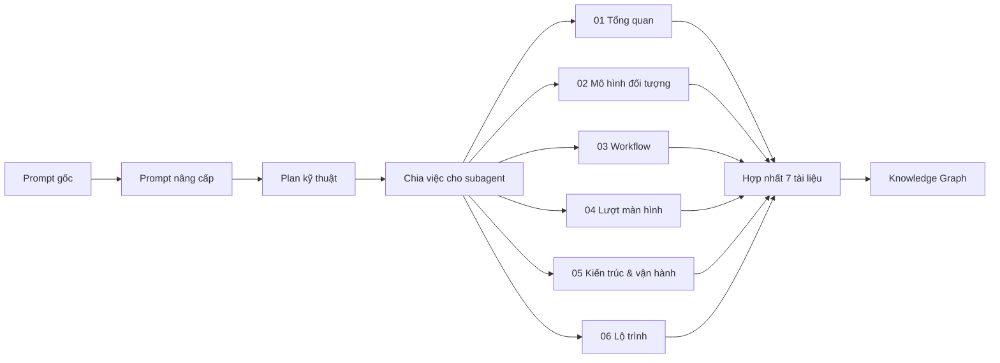
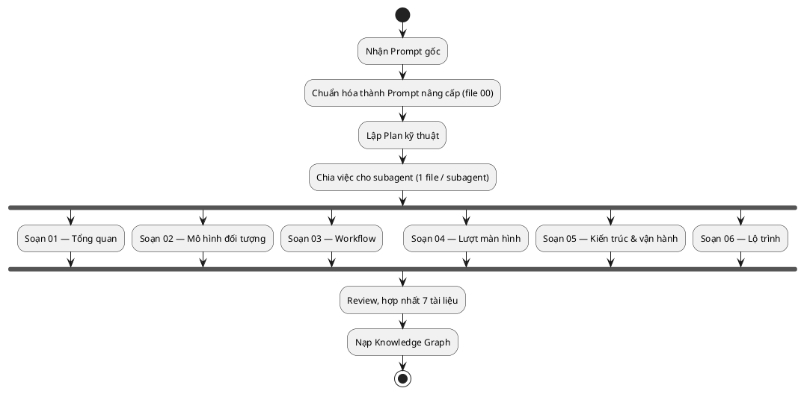

# 00 — Prompt dựng Plan kỹ thuật

File này đóng vai trò "điểm vào" (entry point) của bộ tài liệu thiết kế hệ thống **PerGoal**: nó lưu lại prompt gốc của người dùng, phiên bản prompt đã được cấu trúc hóa thành prompt dựng plan kỹ thuật, quy trình thực hiện, cách chia việc cho subagent và Definition of Done. Toàn bộ thuật ngữ, tên class, trạng thái và tên màn hình trong các file 01–06 PHẢI khớp canonical spec của dự án.

## Mục lục tài liệu

| # | File | Mô tả |
|---|---|---|
| 00 | [00 — Prompt dựng Plan kỹ thuật](./00-PROMPT-PLAN-KY-THUAT.md) | File này — prompt gốc, prompt nâng cấp, quy trình và cách chia việc. |
| 01 | [01 — Tổng quan hệ thống](./01-tong-quan-he-thong.md) | Bối cảnh, mục tiêu sản phẩm, actors, phạm vi MVP → v2. |
| 02 | [02 — Mô hình hướng đối tượng](./02-mo-hinh-huong-doi-tuong.md) | Class diagram, entities/value objects/enums, quan hệ và phương thức. |
| 03 | [03 — Workflow hệ thống](./03-workflow-he-thong.md) | 5 workflow chính: onboarding, tạo mục tiêu, sinh task lặp, nhắc nhở, tổng kết tuần. |
| 04 | [04 — Lượt màn hình](./04-luot-man-hinh.md) | UI flow LandingPage → AuthPage → OnboardingPage → MainPage và 6 tab. |
| 05 | [05 — Kiến trúc và vận hành](./05-kien-truc-va-van-hanh.md) | Kiến trúc client/API/service/domain/infra, luồng dữ liệu, scheduler. |
| 06 | [06 — Lộ trình triển khai](./06-lo-trinh-trien-khai.md) | Roadmap MVP → v1.1 → v1.2 → v2 kèm tiêu chí nghiệm thu. |

## Prompt gốc

> Bạn là một nhà thiết kế, hãy thực hiện dựng workflow và thiết kế các hướng đối tượng cho cấu trúc một hệ thống: Hệ thống: Quản lý mục tiêu và thói quen cá nhân. Mô tả: cho phép người dùng tạo mục tiêu và nhiệm vụ (có thể lặp lại), đặt tính chất cho mục tiêu (độ ưu tiên, năng suất dùng cho nhiệm vụ), app quản lý và nhắc nhở để đảm bảo mục tiêu hoàn thành. Mục tiêu: cải thiện và tạo thói quen quản lý mục tiêu. Nhiệm vụ: dựng đối tượng + workflow dưới dạng file markdown vào folder graphify, rõ cấu trúc LandingPage -> MainPage và cách hoạt động của web/app.

## Prompt nâng cấp

### Vai trò

Bạn là **System Designer / Software Architect** chịu trách nhiệm chuyển một mô tả sản phẩm ở mức ý tưởng thành **plan kỹ thuật** hoàn chỉnh (object model + workflow + UI flow + kiến trúc) dưới dạng bộ tài liệu markdown có thể dùng làm nguồn cho knowledge graph.

### Bối cảnh

- Hệ thống: **PerGoal** — web app (responsive/PWA) cho phép người dùng tạo **Goal**, nhiệm vụ một lần và lặp lại (**Task/OneTimeTask/RecurringTask/Habit**), đặt thuộc tính (**Priority**, **ProductivityMetric**), hệ thống nhắc nhở (**Reminder**, **ReminderScheduler**) để đảm bảo hoàn thành.
- Mục tiêu sản phẩm: hình thành và duy trì thói quen quản lý mục tiêu cho người dùng.
- Đối tượng đọc: giảng viên/người chấm đồ án OOAD, thành viên nhóm triển khai, và các subagent viết tài liệu.

### Input

- Mô tả hệ thống (prompt gốc) và canonical spec thống nhất: actors, danh sách class cố định, enums, services, danh sách màn hình, 5 workflow, kiến trúc, roadmap.
- Folder output: `graphify/` (chỉ ghi file trong folder này, không tạo file ngoài).
- Quy ước: tiếng Việt, thuật ngữ kỹ thuật giữ tiếng Anh; không bịa entity/trạng thái ngoài spec.

### Nhiệm vụ chi tiết

1. **Xác định actors & use case** — liệt kê actor (`User`, `Scheduler/Reminder Engine`, `NotificationService`, `Admin`), use case chính và ánh xạ use case → màn hình/service tương ứng.
2. **Mô hình hóa đối tượng** — vẽ class diagram cho entities (`User`, `Goal`, `Task`, `OneTimeTask`, `RecurringTask`, `Habit`, `TaskInstance`, `ProgressLog`, `Streak`, `Reminder`), value objects (`ProductivityMetric`, `RecurrenceRule`), enums (`Priority`, `GoalStatus`, `TaskStatus`, `ReminderStatus`, `ReminderChannel`, `Frequency`, `HabitType`); nêu quan hệ, bội số, phương thức chính.
3. **Đặc tả workflow** — mô tả 5 workflow cố định: onboarding & đăng ký; tạo mục tiêu; sinh nhiệm vụ lặp lại; vòng lặp nhắc nhở & hoàn thành; tổng kết tuần — kèm sequence/activity diagram.
4. **Đặc tả UI flow** — luồng `LandingPage → AuthPage → OnboardingPage → MainPage` → 6 tab (`DashboardPage`, `GoalsPage`/`GoalDetailPage`/`GoalFormPage`, `HabitsPage`/`HabitDetailPage`, `CalendarPage`, `StatsPage`, `SettingsPage`) và các overlay (`ReminderPopup`, `NotificationCenter`, `TaskFormModal`).
5. **Đặc tả kiến trúc & vận hành** — client SPA (React + TypeScript, PWA), REST/JSON + JWT, application/domain/infrastructure layer, PostgreSQL, Redis + job queue, worker ReminderScheduler, Web Push, Email; luồng dữ liệu end-to-end và vận hành scheduler.

### Đầu ra & vị trí file

| # | File | Nội dung bắt buộc |
|---|---|---|
| 00 | `./00-PROMPT-PLAN-KY-THUAT.md` | Prompt gốc, prompt nâng cấp, quy trình, chia việc subagent, DoD (file này). |
| 01 | `./01-tong-quan-he-thong.md` | Bối cảnh, mục tiêu, actors, use case, phạm vi MVP → v2. |
| 02 | `./02-mo-hinh-huong-doi-tuong.md` | Class diagram, bảng entities/value objects/enums, quan hệ & phương thức. |
| 03 | `./03-workflow-he-thong.md` | 5 workflow chính với activity/sequence diagram. |
| 04 | `./04-luot-man-hinh.md` | UI flow LandingPage → MainPage, sơ đồ điều hướng, đặc tả từng page. |
| 05 | `./05-kien-truc-va-van-hanh.md` | Kiến trúc layer, API endpoints, infra, luồng dữ liệu, scheduler. |
| 06 | `./06-lo-trinh-trien-khai.md` | Roadmap theo phiên bản, ưu tiên, tiêu chí nghiệm thu. |

### Ràng buộc

- Ngôn ngữ **tiếng Việt**, thuật ngữ kỹ thuật (class, enum, service, workflow...) giữ **tiếng Anh**.
- Mọi sơ đồ quan trọng vẽ **cả Mermaid và PlantUML**, đặt trong 2 code block liền nhau, có chú thích ngắn bên dưới.
- Mỗi file có cross-link relative tới các file liên quan (dạng `./03-workflow-he-thong.md`) và kết thúc bằng mục `## Liên kết`.
- **Không bịa entity, trạng thái, màn hình ngoài spec**; nếu cần mở rộng phải ghi rõ "(mở rộng v2)".
- Bảng dùng markdown table, code block có nhãn ngôn ngữ; không tạo file ngoài folder `graphify/`.

### Quy trình thực hiện

1. Đọc canonical spec và prompt gốc, chốt danh mục thuật ngữ dùng chung.
2. Viết **Prompt nâng cấp** (file 00) làm nguồn điều phối cho toàn bộ tài liệu.
3. Lập **Plan kỹ thuật**: xác định cấu trúc, mục lục, thứ tự phụ thuộc giữa 7 file.
4. Chia việc cho subagent — mỗi subagent phụ trách đúng 1 file, dùng chung spec và prompt nâng cấp.
5. Subagent viết tài liệu song song; mỗi đầu ra tuân thủ quy ước trình bày (Mermaid + PlantUML, bảng, cross-link).
6. Review & hợp nhất: kiểm tra thuật ngữ khớp spec, cross-link không gãy, không thừa entity.
7. Nạp toàn bộ 7 tài liệu vào **Knowledge Graph** (node = khái niệm, edge = quan hệ) để tra cứu và kiểm tra tính nhất quán.

*Chú thích: pipeline từ **Prompt gốc** → **Prompt nâng cấp** → **Plan kỹ thuật** → 7 tài liệu (00–06) → **Knowledge Graph**; nhánh `fork` thể hiện 6 subagent chạy song song sau khi chốt plan.*

### Cách chia việc cho subagent để tăng tốc

- **1 subagent / 1 file** — mỗi subagent nhận đúng một đường dẫn output, không ghi đè file của subagent khác.
- **Chạy song song** — sau khi file 00 (prompt nâng cấp + plan) hoàn tất, kích hoạt đồng thời các subagent 01–06.
- **Dùng chung spec chuẩn** — mọi subagent đọc canonical spec + prompt nâng cấp trước khi viết để thống nhất tên class, enum, trạng thái, màn hình.
- **Giao diện chung** — chốt trước danh mục liên kết chéo (mỗi file trỏ tới file nào) để tránh link gãy.
- **Người hợp nhất** — một vai trò review cuối kiểm tra trùng lặp, sai thuật ngữ và tính đầy đủ của 7 file.

### Definition of Done

- [ ] File 00 chứa đủ: prompt gốc, prompt nâng cấp, quy trình 7 bước, cách chia việc subagent, DoD.
- [ ] Đủ 7 file markdown trong `graphify/`, đúng tên và đúng vị trí.
- [ ] Mỗi file có tiêu đề, đoạn mở đầu, mục `## Liên kết` với relative link hợp lệ.
- [ ] Mỗi sơ đồ quan trọng có cặp code block Mermaid + PlantUML liền nhau kèm chú thích.
- [ ] Thuật ngữ khớp canonical spec, không có entity/trạng thái tự thêm ngoài "(mở rộng v2)".
- [ ] Toàn bộ tài liệu nạp được vào knowledge graph và liên kết chéo không gãy.

## Hướng dẫn sử dụng lại prompt

- Copy nguyên mục **Prompt nâng cấp** để tái sử dụng cho hệ thống khác; chỉ cần thay phần **Bối cảnh** và bảng **Đầu ra & vị trí file**.
- Giữ nguyên **Ràng buộc** và **Quy trình thực hiện** để đảm bảo mọi plan kỹ thuật đều có đủ sơ đồ Mermaid + PlantUML và cross-link.
- Khi chạy đa subagent, luôn phát kèm prompt nâng cấp + canonical spec để tránh lệch thuật ngữ.
- Kiểm tra **Definition of Done** trước khi hợp nhất và trước khi nạp knowledge graph.

## Liên kết

- [00 — Prompt dựng Plan kỹ thuật](./00-PROMPT-PLAN-KY-THUAT.md)
- [01 — Tổng quan hệ thống](./01-tong-quan-he-thong.md)
- [02 — Mô hình hướng đối tượng](./02-mo-hinh-huong-doi-tuong.md)
- [03 — Workflow hệ thống](./03-workflow-he-thong.md)
- [04 — Lượt màn hình](./04-luot-man-hinh.md)
- [05 — Kiến trúc và vận hành](./05-kien-truc-va-van-hanh.md)
- [06 — Lộ trình triển khai](./06-lo-trinh-trien-khai.md)
