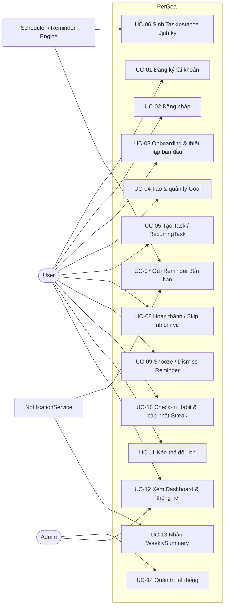
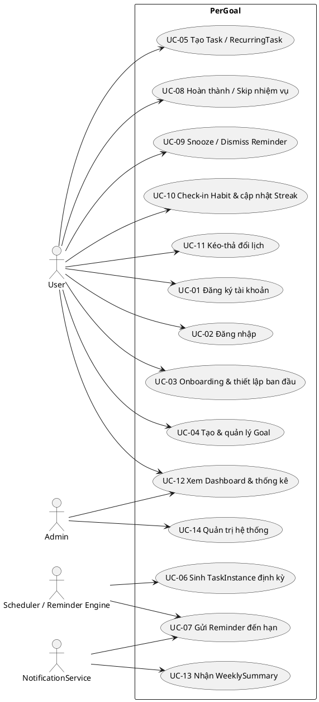
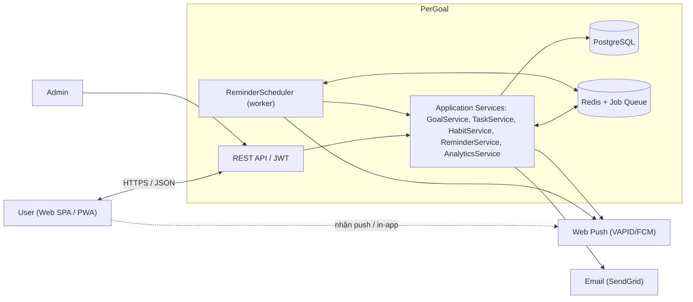
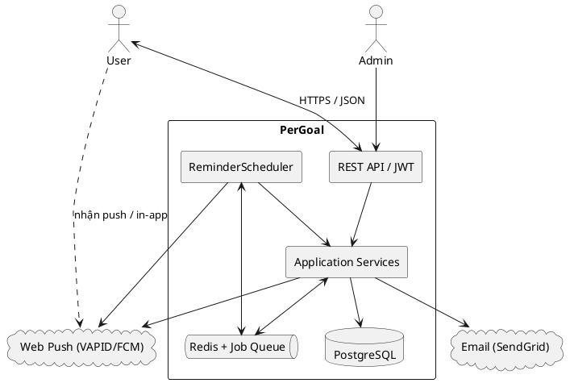

# 01 — Tổng quan hệ thống

Tài liệu này trình bày bức tranh tổng quan của **PerGoal** — hệ thống web app (responsive/PWA) giúp người dùng tạo mục tiêu (Goal), quản lý nhiệm vụ một lần & lặp lại (Task/RecurringTask/Habit), đặt thuộc tính (độ ưu tiên, năng suất/effort) và nhận nhắc nhở để đảm bảo hoàn thành. Nội dung gồm vấn đề & tầm nhìn, mục tiêu, phạm vi, tác nhân, yêu cầu chức năng/phi chức năng, danh sách use case kèm sơ đồ, và sơ đồ ngữ cảnh hệ thống. Mọi thuật ngữ, tên class, trạng thái, tên màn hình trong tài liệu đều tuân theo canonical spec của dự án.

## 1. Vấn đề & Tầm nhìn

**Nỗi đau người dùng:**

- **Quên nhiệm vụ**: người dùng đặt ra mục tiêu nhưng không có cơ chế nhắc nhở đúng lúc, đúng kênh, dẫn đến bỏ lỡ nhiệm vụ và mục tiêu dở dang.
- **Thiếu nhất quán**: mục tiêu, nhiệm vụ và thói quen nằm rải rác ở ghi chú, lịch, ứng dụng khác nhau; không có một nguồn dữ liệu thống nhất để theo dõi tiến độ.
- **Không đo lường được**: người dùng không biết mình đã hoàn thành bao nhiêu phần trăm mục tiêu, dành bao nhiêu phút tập trung, hay chuỗi thói quen (Streak) đang ở mức nào để điều chỉnh hành vi.

**Giá trị PerGoal mang lại:**

- Một nơi duy nhất để tạo và theo dõi **Goal → Task/RecurringTask/Habit** với độ ưu tiên (Priority) và năng suất (ProductivityMetric) rõ ràng.
- **Scheduler / Reminder Engine** chạy nền tự động sinh nhiệm vụ lặp lại (TaskInstance), quét Reminder đến hạn và phối hợp **NotificationService** gửi qua IN_APP/PUSH/EMAIL — đảm bảo người dùng không quên.
- **AnalyticsService** đo lường completion rate, focus minutes, streak history và WeeklySummary, biến việc quản lý mục tiêu thành thói quen có dữ liệu phản hồi.
- Tầm nhìn dài hạn: hình thành thói quen quản lý mục tiêu cho người dùng, hướng tới các mở rộng v2 như AI gợi ý mục tiêu, accountability partner, gamification (mở rộng v2).

## 2. Mục tiêu hệ thống

| ID | Mục tiêu (SMART) | Chỉ số đo lường | Thời hạn |
|---|---|---|---|
| G-01 | Giảm tỷ lệ bỏ lỡ nhiệm vụ nhờ nhắc nhở đúng hạn | ≥ 95% Reminder đến hạn được dispatch trong vòng 60 giây; giảm 30% số Task ở trạng thái OVERDUE sau 4 tuần sử dụng | 3 tháng sau ra mắt |
| G-02 | Tăng tỷ lệ hoàn thành mục tiêu của người dùng | Người dùng đạt completion rate ≥ 70% mỗi tuần sau 30 ngày sử dụng | 30 ngày/người dùng |
| G-03 | Hình thành thói quen sử dụng đều đặn | ≥ 60% người dùng có ít nhất một Habit với Streak ≥ 7 ngày trong tháng đầu | 1 tháng sau ra mắt |
| G-04 | Đo lường được toàn bộ tiến độ | 100% lượt complete/skip sinh ProgressLog; StatsPage hiển thị completion rate & focus minutes với độ trễ cập nhật < 5 giây | MVP → v1.2 |
| G-05 | Thu hút người dùng mới qua phễu Landing → Onboarding | ≥ 500 tài khoản đăng ký trong 3 tháng; ≥ 40% lượt truy cập LandingPage hoàn tất OnboardingPage | 3 tháng sau ra mắt |
| G-06 | Vận hành ổn định và đáng tin cậy | Uptime ≥ 99.5%/tháng; tỷ lệ Reminder ở trạng thái FAILED < 0.5% | Liên tục hằng tháng |

## 3. Phạm vi

Phạm vi bám theo roadmap 4 giai đoạn của spec: **MVP**, **v1.1**, **v1.2**, **v2**.

| Giai đoạn | Hạng mục | Trong phạm vi tài liệu này |
|---|---|---|
| MVP | Auth, Goal CRUD, Task one-time + recurring, in-app reminder, Dashboard | Có |
| v1.1 | Habit + Streak, CalendarPage | Có |
| v1.2 | Push/Email notification, StatsPage, WeeklySummary | Có (thiết kế sẵn, triển khai theo giai đoạn) |
| v2 | AI gợi ý mục tiêu, accountability partner, gamification (mở rộng v2) | Không (chỉ nêu định hướng) |

**In-scope:**

- Tài khoản: Register/Login/ForgotPassword (AuthPage), JWT auth, Onboarding (timezone, giờ nhắc mặc định, Goal đầu tiên), Settings (profile, notification channels, theme).
- Mục tiêu: Goal CRUD, vòng đời GoalStatus (DRAFT → ACTIVE → COMPLETED/ARCHIVED, OVERDUE), `Goal.calculateProgress()`.
- Nhiệm vụ: OneTimeTask, RecurringTask với RecurrenceRule, sinh TaskInstance tự động, hoàn thành/skip/reschedule, ProductivityMetric, CalendarPage kéo-thả đổi lịch.
- Thói quen: Habit (BUILD/QUIT), check-in, Streak, calendar heatmap.
- Nhắc nhở: Reminder với ReminderChannel (IN_APP/PUSH/EMAIL), snooze/dismiss, dispatch tự động, ReminderPopup & NotificationCenter.
- Thống kê: DashboardPage, StatsPage (completion rate, focus minutes, streak history), WeeklySummary.
- Vận hành: ReminderScheduler (cron mỗi phút và cron 00:00 hằng ngày), job queue, push/email provider.

**Out-of-scope:**

- AI gợi ý mục tiêu (mở rộng v2).
- Accountability partner — cộng tác giữa nhiều người dùng (mở rộng v2).
- Gamification — điểm, huy hiệu, bảng xếp hạng (mở rộng v2).
- Ứng dụng native iOS/Android riêng (ngoài roadmap; PWA là kênh mobile chính thức).
- Tích hợp bên thứ ba ngoài Web Push (VAPID/FCM) và Email (SendGrid) (ngoài roadmap).

## 4. Tác nhân

| Tác nhân | Loại | Mô tả | Quyền chính |
|---|---|---|---|
| **User** | Người | Người dùng cuối, tác nhân chính của hệ thống | Đăng ký/đăng nhập; CRUD Goal, Task/RecurringTask/Habit; complete/skip/reschedule; check-in Habit; snooze/dismiss Reminder; cấu hình notificationChannels & timezone; xem Dashboard/StatsPage |
| **Scheduler / Reminder Engine** | Hệ thống (chạy nền) | Worker chạy cron; mỗi phút quét Reminder đến hạn, cron 00:00 hằng ngày sinh TaskInstance từ RecurrenceRule và đánh dấu OVERDUE | Đọc Reminder/Task/RecurringTask đến hạn; tạo TaskInstance; chuyển ReminderStatus; kích hoạt NotificationService |
| **NotificationService** | Hệ thống | Dịch vụ gửi thông báo qua IN_APP, PUSH, EMAIL; gửi WeeklySummary | Gửi notification cho User; cập nhật trạng thái gửi (SENT/FAILED) |
| **Admin** | Người (phụ) | Quản trị viên hệ thống | Quản lý người dùng; theo dõi job và Reminder FAILED; cấu hình hệ thống |

## 5. Yêu cầu chức năng

### 5.1 Tài khoản

| FR | Actor | Mô tả | Ưu tiên |
|---|---|---|---|
| FR-01 | User | Đăng ký tài khoản bằng email + password; hệ thống hash password trước khi lưu `passwordHash` | Must |
| FR-02 | User | Đăng nhập và nhận JWT để gọi các API `/auth`, `/goals`, `/tasks`, `/habits`, `/instances`, `/reminders`, `/stats` | Must |
| FR-03 | User | Khôi phục mật khẩu qua ForgotPassword (tab trong AuthPage) | Should |
| FR-04 | User | Onboarding 3 bước: chọn timezone, giờ nhắc mặc định, tạo Goal đầu tiên | Must |
| FR-05 | User | Cập nhật profile, notificationChannels, timezone, theme trong SettingsPage | Should |

### 5.2 Mục tiêu

| FR | Actor | Mô tả | Ưu tiên |
|---|---|---|---|
| FR-06 | User | Tạo Goal mới (title, description, category, priority, deadline) từ GoalFormPage; Goal khởi tạo ở trạng thái DRAFT | Must |
| FR-07 | User | Sửa/xóa Goal; xem GoalDetailPage với danh sách Task và tiến độ | Must |
| FR-08 | User | Kích hoạt (activate), hoàn thành (complete), lưu trữ (archive) Goal; hệ thống tính `calculateProgress()` và chuyển GoalStatus tương ứng (ACTIVE/COMPLETED/ARCHIVED/OVERDUE) | Must |

### 5.3 Nhiệm vụ

| FR | Actor | Mô tả | Ưu tiên |
|---|---|---|---|
| FR-09 | User | Tạo OneTimeTask trong Goal với priority, ProductivityMetric (estimatedMinutes, energyLevel, weight), dueAt | Must |
| FR-10 | User | Tạo RecurringTask với RecurrenceRule (frequency, interval, daysOfWeek, startDate, endDate) | Must |
| FR-11 | Scheduler | Cron 00:00 hằng ngày quét RecurringTask/Habit và sinh TaskInstance cho ngày/tuần tương ứng; cập nhật DashboardPage | Must |
| FR-12 | User | Hoàn thành (complete), skip hoặc reschedule TaskInstance; cập nhật TaskStatus (PENDING/IN_PROGRESS/DONE/SKIPPED/OVERDUE) | Must |
| FR-13 | User | Ghi ProgressLog (minutesSpent, note) cho TaskInstance đã hoàn thành | Should |
| FR-14 | User | Xem CalendarPage tuần/tháng và kéo-thả đổi lịch TaskInstance | Should |

### 5.4 Thói quen

| FR | Actor | Mô tả | Ưu tiên |
|---|---|---|---|
| FR-15 | User | Tạo và check-in Habit (goalType BUILD/QUIT); hệ thống cập nhật Streak (current, longest, lastCheckInDate) | Should |
| FR-16 | User | Xem HabitDetailPage với calendar heatmap, nút check-in và thông tin Streak | Should |

### 5.5 Nhắc nhở

| FR | Actor | Mô tả | Ưu tiên |
|---|---|---|---|
| FR-17 | User | Tạo Reminder cho Task/Habit: remindAt, channel (IN_APP/PUSH/EMAIL), repeatRule | Must |
| FR-18 | Scheduler | Cron mỗi phút quét Reminder đến hạn và yêu cầu NotificationService gửi; cập nhật ReminderStatus (SCHEDULED → SENT/FAILED) | Must |
| FR-19 | User | Snooze (chọn số phút) hoặc dismiss Reminder từ ReminderPopup/NotificationCenter | Must |
| FR-20 | NotificationService | Gửi push (Web Push VAPID/FCM) và email (SendGrid) khi Reminder đến hạn hoặc WeeklySummary | Should |

### 5.6 Thống kê

| FR | Actor | Mô tả | Ưu tiên |
|---|---|---|---|
| FR-21 | User | Xem DashboardPage "Hôm nay": Today's tasks, progress ring, streak widget, quick-add FAB | Must |
| FR-22 | User | Xem StatsPage: completion rate, focus minutes, streak history và biểu đồ | Should |
| FR-23 | NotificationService | Chủ nhật 20:00, AnalyticsService tổng hợp dữ liệu và gửi WeeklySummary (email/push), đồng thời cập nhật StatsPage | Should |

## 6. Yêu cầu phi chức năng

| NFR | Hạng mục | Yêu cầu | Tiêu chí đo lường |
|---|---|---|---|
| NFR-01 | Hiệu năng | Push reminder đến hạn phải được gửi nhanh | Độ trễ từ remindAt đến khi gửi < 60 giây (Scheduler cron mỗi phút) |
| NFR-02 | Độ tin cậy | Không được mất Reminder | Mọi Reminder SCHEDULED đến hạn đều được dispatch; nếu lỗi chuyển FAILED và retry qua job queue; tỷ lệ FAILED < 0.5% |
| NFR-03 | Bảo mật | Xác thực và bảo vệ dữ liệu | JWT cho mọi API; password hash (không lưu plaintext); HTTPS toàn tuyến; phân quyền User/Admin |
| NFR-04 | Khả dụng | Hệ thống sẵn sàng cho người dùng | Uptime ≥ 99.5%/tháng; Dashboard tải < 2 giây |
| NFR-05 | Khả năng mở rộng | API stateless, worker tách riêng | Scale ngang API; ReminderScheduler chạy trên job queue (Redis + BullMQ/Celery) có thể nhân bản worker |
| NFR-06 | i18n / Timezone | Lưu trữ và hiển thị thời gian chính xác | Lưu UTC trong PostgreSQL; hiển thị theo `User.timezone`; giao diện tiếng Việt trước, sẵn sàng i18n |
| NFR-07 | UX | Trải nghiệm responsive/PWA, thao tác nhanh | Hỗ trợ desktop sidebar và mobile bottom-nav; quick-add nhiệm vụ ≤ 3 bước; PWA nhận push notification |
| NFR-08 | Khả năng bảo trì | Kiến trúc phân lớp rõ ràng | Tách Client / API / Application layer (Service) / Domain layer / Infrastructure; domain thuần, dễ viết unit test |

## 7. Use Case

| UC | Tên use case | Actor chính | Workflow spec | Màn hình liên quan |
|---|---|---|---|---|
| UC-01 | Đăng ký tài khoản | User | WF-1 (Onboarding & Đăng ký) | LandingPage → AuthPage (Register) |
| UC-02 | Đăng nhập | User | WF-1 | AuthPage (Login) |
| UC-03 | Onboarding & thiết lập ban đầu | User | WF-1 | OnboardingPage → MainPage |
| UC-04 | Tạo & quản lý Goal | User | WF-2 (Tạo mục tiêu) | GoalsPage, GoalFormPage, GoalDetailPage |
| UC-05 | Tạo Task / RecurringTask | User | WF-2 | GoalFormPage, TaskFormModal |
| UC-06 | Sinh TaskInstance định kỳ | Scheduler / Reminder Engine | WF-3 (Sinh nhiệm vụ lặp lại) | (chạy nền, cập nhật DashboardPage) |
| UC-07 | Gửi Reminder đến hạn | Scheduler / Reminder Engine, NotificationService | WF-4 (Vòng lặp nhắc nhở & hoàn thành) | ReminderPopup, NotificationCenter |
| UC-08 | Hoàn thành / Skip nhiệm vụ | User | WF-4 | DashboardPage, TaskFormModal |
| UC-09 | Snooze / Dismiss Reminder | User | WF-4 | ReminderPopup |
| UC-10 | Check-in Habit & cập nhật Streak | User | WF-4 | HabitsPage, HabitDetailPage |
| UC-11 | Kéo-thả đổi lịch | User | WF-2, WF-4 | CalendarPage |
| UC-12 | Xem Dashboard & thống kê | User | WF-4, WF-5 (Tổng kết tuần) | DashboardPage, StatsPage |
| UC-13 | Nhận WeeklySummary | NotificationService | WF-5 | StatsPage, Email/Push |
| UC-14 | Quản trị hệ thống | Admin | — | Khu vực admin |

*Chú thích: User tương tác các use case nghiệp vụ qua MainPage và các tab; Scheduler / Reminder Engine và NotificationService là actor hệ thống chạy nền đảm nhiệm sinh TaskInstance và gửi Reminder/WeeklySummary; Admin quản trị hệ thống. Danh sách UC khớp 5 workflow chính ở mục 5 của spec.*

## 8. Sơ đồ ngữ cảnh hệ thống

*Chú thích: User tương tác PerGoal qua REST API/JWT từ Web SPA/PWA; bên trong, API gọi các Application Service, dữ liệu lưu ở PostgreSQL và job đặt qua Redis + Job Queue. ReminderScheduler quét Reminder đến hạn và phối hợp NotificationService gửi qua Web Push (VAPID/FCM) hoặc Email (SendGrid); Admin truy cập API với quyền quản trị.*

## Liên kết

- [00 — Kế hoạch kỹ thuật](./00-PROMPT-PLAN-KY-THUAT.md): Prompt & kế hoạch triển khai bộ tài liệu thiết kế.
- [02 — Mô hình hướng đối tượng](./02-mo-hinh-huong-doi-tuong.md): Class diagram, entities, value objects, enums và quan hệ.
- [03 — Workflow hệ thống](./03-workflow-he-thong.md): 5 workflow chính với sequence/activity diagram.
- [04 — Lượt màn hình](./04-luot-man-hinh.md): Screen flow LandingPage → AuthPage → OnboardingPage → MainPage và các tab.
- [05 — Kiến trúc và vận hành](./05-kien-truc-va-van-hanh.md): Kiến trúc phân lớp, hạ tầng, triển khai và vận hành.
