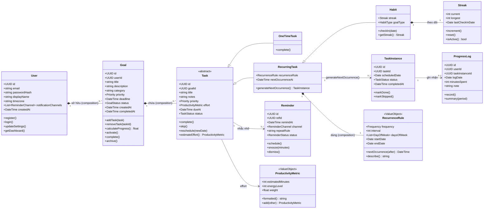
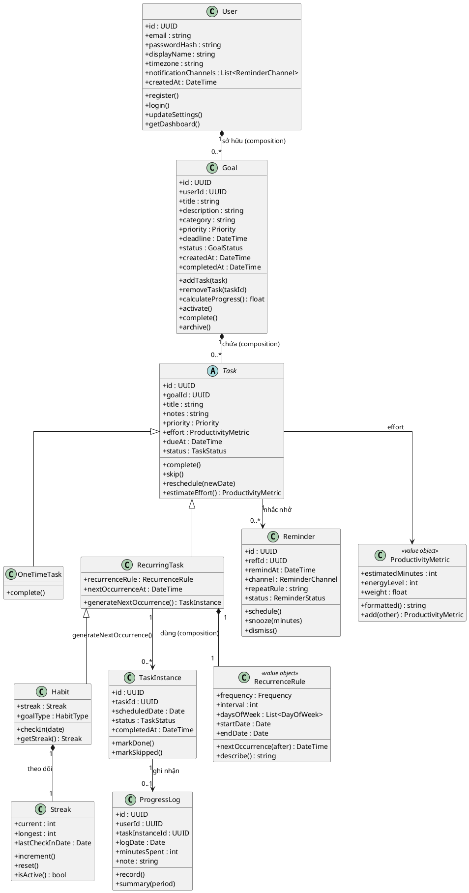
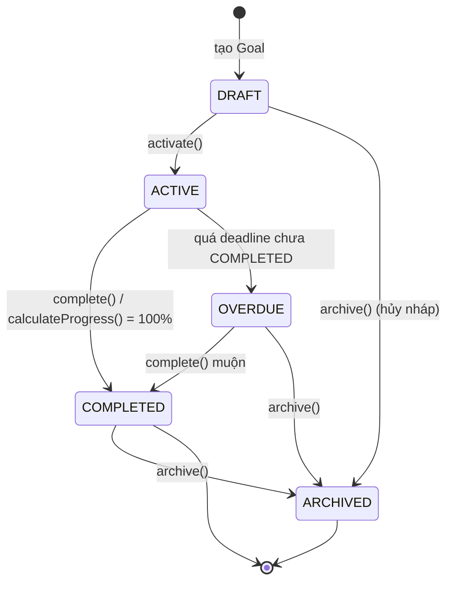
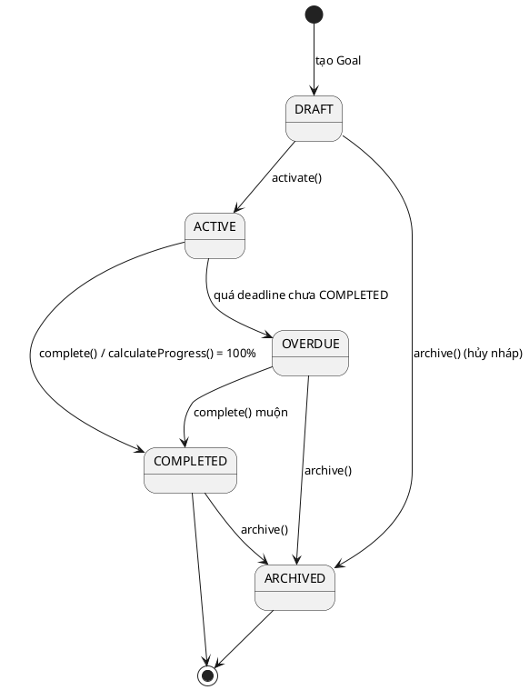
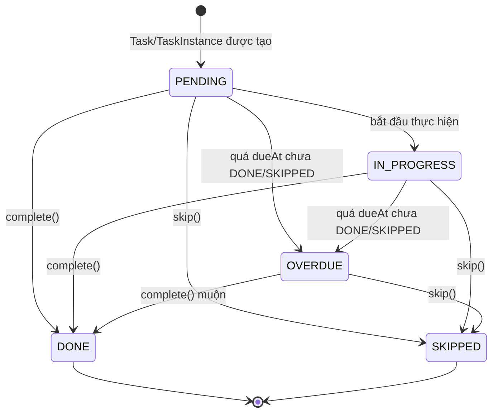
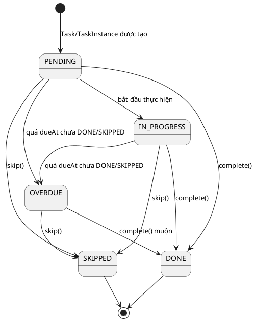

# 02 — Mô hình hướng đối tượng

Tài liệu này mô tả **mô hình miền hướng đối tượng** của hệ thống **Goal Habit Manager (GHM)** bằng sơ đồ lớp, đặc tả từng class, value object, enumeration, state diagram và ví dụ cài đặt. Triết lý thiết kế:

- **Entity = danh từ nghiệp vụ**: mỗi khái niệm người dùng nhìn thấy trong miền (Goal, Task, Habit, Streak, Reminder...) là một entity có định danh (`id`), vòng đời và trạng thái riêng.
- **Service = hành vi liên entity**: các hành vi vắt qua nhiều entity hoặc cần phối hợp hạ tầng (sinh instance, quét nhắc nhở, thống kê) được đặt trong application/domain service (`GoalService`, `TaskService`, `HabitService`, `ReminderService`, `AnalyticsService`, `NotificationService`, `ReminderScheduler`) thay vì nhồi vào entity.
- **Value Object = bất biến**: các khái niệm không có định danh, được so sánh bằng giá trị (`ProductivityMetric`, `RecurrenceRule`) được thiết kế immutable — mọi phép biến đổi trả về instance mới.

---

## 1. Sơ đồ lớp tổng thể





**Chú thích quan hệ:**

- `User 1 *-- 0..* Goal` (composition): Goal không tồn tại độc lập ngoài User; xóa User thì Goal bị xóa theo. Tương tự `Goal 1 *-- 0..* Task`.
- `Task <|-- OneTimeTask`, `Task <|-- RecurringTask`, `RecurringTask <|-- Habit` (inheritance): `Task` là lớp trừu tượng; `Habit` là trường hợp đặc biệt của `RecurringTask` có thêm `Streak` và `HabitType`.
- `RecurringTask 1 *-- 1 RecurrenceRule` (composition): quy tắc lặp thuộc sở hữu của task lặp, là value object bất biến.
- `Habit 1 *-- 1 Streak`: mỗi Habit có đúng một Streak theo dõi chuỗi ngày.
- `RecurringTask 1 --> 0..* TaskInstance`: mỗi lần lặp sinh một instance cụ thể theo ngày.
- `TaskInstance 1 --> 0..1 ProgressLog`: mỗi instance có tối đa một bản ghi tiến độ.
- `Task 1 --> 0..* Reminder`: một task/habit có thể có nhiều reminder; `Reminder.refId` trỏ tới `taskId` (hoặc `habitId`).
- `Task --> ProductivityMetric`: `effort` là value object nhúng, không có bảng riêng.

---

## 2. Đặc tả chi tiết từng Class

### 2.1 User

| Thuộc tính | Kiểu | Mô tả |
|---|---|---|
| id | UUID | Định danh duy nhất của người dùng |
| email | string | Email đăng nhập, duy nhất |
| passwordHash | string | Mật khẩu đã băm (không lưu plaintext) |
| displayName | string | Tên hiển thị |
| timezone | string | Múi giờ dùng để tính ngày/giờ nhắc |
| notificationChannels | List\<ReminderChannel\> | Kênh nhận thông báo ưa thích (IN_APP/PUSH/EMAIL) |
| createdAt | DateTime | Thời điểm tạo tài khoản |

| Phương thức | Mô tả ngắn |
|---|---|
| register() | Đăng ký tài khoản mới, khởi tạo hồ sơ mặc định |
| login() | Xác thực thông tin đăng nhập, trả token phiên |
| updateSettings() | Cập nhật profile, timezone, notificationChannels |
| getDashboard() | Trả dữ liệu tổng hợp cho DashboardPage ("Hôm nay") |

### 2.2 Goal

| Thuộc tính | Kiểu | Mô tả |
|---|---|---|
| id | UUID | Định danh Goal |
| userId | UUID | Chủ sở hữu (FK tới User) |
| title | string | Tiêu đề mục tiêu |
| description | string | Mô tả chi tiết |
| category | string | Nhóm/phân loại mục tiêu |
| priority | Priority | Độ ưu tiên |
| deadline | DateTime | Hạn hoàn thành |
| status | GoalStatus | Trạng thái vòng đời |
| createdAt | DateTime | Thời điểm tạo |
| completedAt | DateTime | Thời điểm hoàn thành (null nếu chưa) |

| Phương thức | Mô tả ngắn |
|---|---|
| addTask(task) | Thêm Task vào Goal |
| removeTask(taskId) | Xóa Task khỏi Goal |
| calculateProgress(): float | Tỷ lệ hoàn thành 0..1 dựa trên Task đã DONE |
| activate() | Chuyển DRAFT → ACTIVE |
| complete() | Đánh dấu hoàn thành, set completedAt |
| archive() | Lưu trữ Goal không còn theo đuổi |

### 2.3 Task (abstract)

| Thuộc tính | Kiểu | Mô tả |
|---|---|---|
| id | UUID | Định danh Task |
| goalId | UUID | Goal chứa Task (FK) |
| title | string | Tiêu đề nhiệm vụ |
| notes | string | Ghi chú thêm |
| priority | Priority | Độ ưu tiên |
| effort | ProductivityMetric | Ước lượng công sức (value object) |
| dueAt | DateTime | Hạn hoàn thành |
| status | TaskStatus | Trạng thái hiện tại |

| Phương thức | Mô tả ngắn |
|---|---|
| complete() | Đánh dấu DONE (đa hình theo lớp con) |
| skip() | Bỏ qua nhiệm vụ (SKIPPED) |
| reschedule(newDate) | Dời lịch, cập nhật dueAt |
| estimateEffort(): ProductivityMetric | Ước lượng công sức cần thiết |

### 2.4 OneTimeTask extends Task

| Thuộc tính | Kiểu | Mô tả |
|---|---|---|
| (kế thừa toàn bộ từ Task) | — | Không thêm thuộc tính riêng |

| Phương thức | Mô tả ngắn |
|---|---|
| complete() | Hoàn thành nhiệm vụ một lần, không sinh instance kế tiếp |

### 2.5 RecurringTask extends Task

| Thuộc tính | Kiểu | Mô tả |
|---|---|---|
| recurrenceRule | RecurrenceRule | Quy tắc lặp (value object bất biến) |
| nextOccurrenceAt | DateTime | Thời điểm lần lặp kế tiếp |

| Phương thức | Mô tả ngắn |
|---|---|
| generateNextOccurrence(): TaskInstance | Sinh TaskInstance cho lần lặp kế tiếp và tính mốc kế tiếp |

### 2.6 Habit extends RecurringTask

| Thuộc tính | Kiểu | Mô tả |
|---|---|---|
| streak | Streak | Chuỗi ngày liên tục (value/entity phụ thuộc) |
| goalType | HabitType | BUILD (xây thói quen) hoặc QUIT (bỏ thói quen) |

| Phương thức | Mô tả ngắn |
|---|---|
| checkIn(date) | Điểm danh một ngày, cập nhật Streak tương ứng |
| getStreak(): Streak | Trả thông tin Streak hiện tại |

### 2.7 TaskInstance

| Thuộc tính | Kiểu | Mô tả |
|---|---|---|
| id | UUID | Định danh instance |
| taskId | UUID | Task/RecurringTask sinh ra instance (FK) |
| scheduledDate | Date | Ngày dự kiến thực hiện |
| status | TaskStatus | Trạng thái của instance |
| completedAt | DateTime | Thời điểm hoàn thành |

| Phương thức | Mô tả ngắn |
|---|---|
| markDone() | Chuyển instance sang DONE, ghi completedAt |
| markSkipped() | Chuyển instance sang SKIPPED |

### 2.8 ProgressLog

| Thuộc tính | Kiểu | Mô tả |
|---|---|---|
| id | UUID | Định danh bản ghi |
| userId | UUID | Người dùng ghi log (FK) |
| taskInstanceId | UUID | Instance được ghi nhận (FK) |
| logDate | Date | Ngày ghi log |
| minutesSpent | int | Số phút đã dành cho nhiệm vụ |
| note | string | Ghi chú |

| Phương thức | Mô tả ngắn |
|---|---|
| record() | Ghi nhận tiến độ cho một TaskInstance |
| summary(period) | Tổng hợp log theo kỳ (ngày/tuần/tháng) cho AnalyticsService |

### 2.9 Streak

| Thuộc tính | Kiểu | Mô tả |
|---|---|---|
| current | int | Chuỗi ngày liên tục hiện tại |
| longest | int | Chuỗi dài nhất từng đạt |
| lastCheckInDate | Date | Ngày check-in gần nhất |

| Phương thức | Mô tả ngắn |
|---|---|
| increment() | Tăng `current` lên 1 và cập nhật `longest` nếu vượt |
| reset() | Đặt `current` về 0 khi chuỗi bị đứt |
| isActive(): bool | Kiểm tra chuỗi còn "sống" (hôm nay/hôm qua có check-in) |

### 2.10 Reminder

| Thuộc tính | Kiểu | Mô tả |
|---|---|---|
| id | UUID | Định danh reminder |
| refId | UUID | ID của Task/Habit được nhắc (đa hình) |
| remindAt | DateTime | Thời điểm cần nhắc |
| channel | ReminderChannel | Kênh gửi (IN_APP/PUSH/EMAIL) |
| repeatRule | string | Quy tắc lặp của reminder (nếu có) |
| status | ReminderStatus | Trạng thái gửi |

| Phương thức | Mô tả ngắn |
|---|---|
| schedule() | Lên lịch nhắc, set status SCHEDULED |
| snooze(minutes) | Hoãn nhắc thêm số phút, set SNOOZED |
| dismiss() | Người dùng tắt nhắc, set DISMISSED |

### Ghi chú thiết kế

- **Vì sao `Task` abstract?** `OneTimeTask` và `RecurringTask` chia sẻ phần lớn thuộc tính (title, priority, effort, dueAt, status) và hành vi (complete, skip, reschedule). Đặt lớp cha abstract cho phép đa hình `complete()` — `OneTimeTask` kết thúc tại chỗ, còn `RecurringTask`/`Habit` kích hoạt sinh instance kế tiếp — và tránh mọi nhánh `if (taskType === ...)` trong service.
- **Vì sao tách `TaskInstance` khỏi `RecurringTask`?** `Task`/`RecurringTask` là *định nghĩa* (template, quy tắc lặp), còn `TaskInstance` là *một lần thực thi cụ thể theo ngày*. Tách ra giúp lưu lịch sử từng ngày, gắn `ProgressLog` đúng lần thực hiện, thống kê completion rate theo thời gian và xử lý OVERDUE ở mức từng instance mà không làm bẩn định nghĩa task.
- **Vì sao `Habit` kế thừa `RecurringTask`?** Habit bản chất là task lặp vô hạn (thường DAILY) nên tái dùng toàn bộ cơ chế sinh instance và `RecurrenceRule`; phần đặc thù chỉ là thêm `Streak` và `HabitType` (BUILD/QUIT) cùng hành vi `checkIn()`.
- **Vì sao `Reminder.refId` đa hình?** Một reminder có thể trỏ tới `Task` hoặc `Habit`; dùng `refId` + ngữ cảnh thay vì hai FK riêng giúp `ReminderScheduler` quét đồng nhất. Ở tầng DB cần ràng buộc/validation để `refId` luôn trỏ tới task tồn tại.
- **Ghi chú về `Goal.calculateProgress()`**: bản MVP đếm theo số `Task` đã `DONE`; hướng mở rộng v2 có thể tính theo trọng số `ProductivityMetric.weight` của từng task.

---

## 3. Value Objects

Hai value object dưới đây **không có `id`**, được so sánh bằng giá trị và **bất biến (immutable)**: mọi thao tác như `add()` hay `nextOccurrence()` đều trả về đối tượng mới thay vì sửa đối tượng cũ. Nhờ vậy chúng an toàn khi chia sẻ giữa các entity, dễ cache và dễ kiểm thử.

### 3.1 ProductivityMetric

| Thuộc tính | Kiểu | Mô tả |
|---|---|---|
| estimatedMinutes | int | Số phút ước lượng để hoàn thành |
| energyLevel | int (1..5) | Mức năng lượng cần thiết (1 thấp → 5 cao) |
| weight | float | Trọng số đóng góp vào mục tiêu |

| Phương thức | Mô tả ngắn |
|---|---|
| formatted(): string | Chuỗi hiển thị thân thiện (ví dụ "45 phút · năng lượng 3/5") |
| add(other): ProductivityMetric | Cộng dồn hai metric, trả về instance mới (bất biến) |

### 3.2 RecurrenceRule

| Thuộc tính | Kiểu | Mô tả |
|---|---|---|
| frequency | Frequency | DAILY, WEEKLY, MONTHLY hoặc CUSTOM |
| interval | int | Khoảng lặp (mỗi 1 ngày, 2 tuần...) |
| daysOfWeek | List\<DayOfWeek\> | Các thứ trong tuần (dùng cho WEEKLY/CUSTOM) |
| startDate | Date | Ngày bắt đầu hiệu lực |
| endDate | Date | Ngày kết thúc (null = vô hạn) |

| Phương thức | Mô tả ngắn |
|---|---|
| nextOccurrence(after): DateTime | Tính mốc lặp kế tiếp sau thời điểm `after` |
| describe(): string | Mô tả dạng người đọc (ví dụ "Mỗi 2 tuần vào Thứ 2, Thứ 5") |

**Pseudo-code `nextOccurrence(after)`:**

```text
function nextOccurrence(after):
    base = max(after, startDate)

    switch frequency:
        case DAILY:
            candidate = base + interval * 1 ngày
            return candidate nếu candidate >= after

        case WEEKLY:
            candidate = base + interval * 7 ngày
            while dayOfWeek(candidate) không thuộc daysOfWeek:
                candidate = candidate + 1 ngày
            return candidate

        case MONTHLY:
            candidate = addMonths(base, interval)   # giữ cùng ngày trong tháng
            nếu ngày không tồn tại trong tháng đích:
                candidate = ngày cuối cùng của tháng đích
            return candidate

        case CUSTOM:
            xử lý như WEEKLY rồi lọc theo daysOfWeek   # (mở rộng v2)

    nếu endDate != null và candidate > endDate:
        return null   # hết hiệu lực, không sinh instance nữa
```

**Vì sao immutable?** `RecurrenceRule` gắn với `RecurringTask` và có thể được nhiều `TaskInstance` suy diễn cùng lúc; nếu cho phép sửa tại chỗ, lịch sử instance đã sinh sẽ sai lệch. Tương tự, `ProductivityMetric` được cộng dồn từ nhiều task để tính tổng effort — trả về instance mới giúp tránh side effect chéo.

---

## 4. Enumerations

### 4.1 Priority

| Giá trị | Ý nghĩa |
|---|---|
| LOW | Ưu tiên thấp |
| MEDIUM | Ưu tiên trung bình (mặc định) |
| HIGH | Ưu tiên cao |
| URGENT | Khẩn cấp, cần xử lý ngay |

### 4.2 GoalStatus

| Giá trị | Ý nghĩa |
|---|---|
| DRAFT | Mới tạo, chưa kích hoạt |
| ACTIVE | Đang theo đuổi |
| COMPLETED | Đã hoàn thành 100% |
| ARCHIVED | Đã lưu trữ, không còn theo dõi |
| OVERDUE | Quá deadline mà chưa hoàn thành |

### 4.3 TaskStatus

| Giá trị | Ý nghĩa |
|---|---|
| PENDING | Chưa bắt đầu |
| IN_PROGRESS | Đang thực hiện |
| DONE | Đã hoàn thành |
| SKIPPED | Bị bỏ qua |
| OVERDUE | Quá hạn mà chưa DONE/SKIPPED |

### 4.4 ReminderStatus

| Giá trị | Ý nghĩa |
|---|---|
| SCHEDULED | Đã lên lịch, chờ đến hạn |
| SENT | Đã gửi thông báo |
| SNOOZED | Người dùng hoãn lại |
| DISMISSED | Người dùng đã tắt |
| FAILED | Gửi thất bại (lỗi kênh/hạ tầng) |

### 4.5 ReminderChannel

| Giá trị | Ý nghĩa |
|---|---|
| IN_APP | Thông báo trong ứng dụng (ReminderPopup, NotificationCenter) |
| PUSH | Web Push (PWA, VAPID/FCM) |
| EMAIL | Gửi qua email (SendGrid) |

### 4.6 Frequency

| Giá trị | Ý nghĩa |
|---|---|
| DAILY | Lặp hằng ngày |
| WEEKLY | Lặp hằng tuần theo `daysOfWeek` |
| MONTHLY | Lặp hằng tháng theo ngày |
| CUSTOM | Quy tắc tùy biến (mở rộng v2) |

### 4.7 HabitType

| Giá trị | Ý nghĩa |
|---|---|
| BUILD | Xây dựng thói quen mới (tăng chuỗi khi check-in) |
| QUIT | Từ bỏ thói quen xấu (duy trì chuỗi ngày không tái phạm) |

---

## 5. State Diagram

### 5.1 Vòng đời GoalStatus





**Chú thích transition chính:**

- `ACTIVE → OVERDUE`: `ReminderScheduler` (cron 00:00 hằng ngày) quét các Goal có `deadline` đã qua nhưng chưa `COMPLETED` và đánh dấu `OVERDUE`.
- `ACTIVE → COMPLETED`: xảy ra khi `complete()` được gọi hoặc `calculateProgress()` đạt 100% (workflow 4 — chúc mừng người dùng).
- `OVERDUE → COMPLETED`: người dùng vẫn có thể hoàn thành muộn; hệ thống ghi nhận và cập nhật `completedAt`.
- `ARCHIVED` là trạng thái kết thúc mềm: Goal không bị xóa cứng, vẫn xem được trong lịch sử.

### 5.2 Vòng đời TaskStatus (áp dụng cho Task và TaskInstance)





**Chú thích transition chính:**

- `PENDING/IN_PROGRESS → OVERDUE`: khi `dueAt` đã qua mà task chưa `DONE`/`SKIPPED`; Scheduler đánh dấu trong cron 00:00 hằng ngày. OVERDUE không phải trạng thái kết thúc — task vẫn có thể `DONE` hoặc `SKIPPED`.
- `→ DONE`: khi người dùng hoàn thành; hệ thống ghi `ProgressLog`, cập nhật `Goal.calculateProgress()` và `Streak` nếu là `Habit` (workflow 4).
- `→ SKIPPED`: bỏ qua có chủ đích; không tính vào completion rate nhưng vẫn giữ lịch sử.
- `DONE` và `SKIPPED` là trạng thái kết thúc của mỗi Task/TaskInstance.

---

## 6. Ví dụ cài đặt (TypeScript)

### 6.1 Goal — `calculateProgress()`

```typescript
import { Priority } from "./enums/Priority";
import { GoalStatus } from "./enums/GoalStatus";
import { TaskStatus } from "./enums/TaskStatus";
import type { Task } from "./Task";

export class Goal {
  private tasks: Task[] = [];

  constructor(
    public readonly id: string,
    public readonly userId: string,
    public title: string,
    public description: string,
    public category: string,
    public priority: Priority,
    public deadline: Date | null,
    public status: GoalStatus = GoalStatus.DRAFT,
    public readonly createdAt: Date = new Date(),
    public completedAt: Date | null = null,
  ) {}

  addTask(task: Task): void {
    if (this.status === GoalStatus.ARCHIVED) {
      throw new Error("Không thể thêm Task vào Goal đã ARCHIVED");
    }
    this.tasks.push(task);
  }

  removeTask(taskId: string): void {
    this.tasks = this.tasks.filter((task) => task.id !== taskId);
  }

  calculateProgress(): number {
    if (this.tasks.length === 0) return 0;
    const doneCount = this.tasks.filter(
      (task) => task.status === TaskStatus.DONE,
    ).length;
    return doneCount / this.tasks.length;
  }

  activate(): void {
    if (this.status !== GoalStatus.DRAFT) {
      throw new Error("Chỉ Goal ở trạng thái DRAFT mới activate được");
    }
    this.status = GoalStatus.ACTIVE;
  }

  complete(): void {
    this.status = GoalStatus.COMPLETED;
    this.completedAt = new Date();
  }

  archive(): void {
    this.status = GoalStatus.ARCHIVED;
  }
}
```

### 6.2 Habit — `checkIn()` và tăng Streak

```typescript
import { RecurringTask } from "./RecurringTask";
import { HabitType } from "./enums/HabitType";
import { Streak } from "./Streak";

export class Habit extends RecurringTask {
  constructor(
    id: string,
    goalId: string,
    title: string,
    public streak: Streak = new Streak(),
    public goalType: HabitType = HabitType.BUILD,
  ) {
    super(id, goalId, title);
  }

  checkIn(date: Date = new Date()): void {
    const today = this.toDateOnly(date);
    const last = this.streak.lastCheckInDate;

    if (last && this.isSameDay(last, today)) {
      return;
    }

    if (!last) {
      this.streak.increment();
    } else {
      const gap = this.diffInDays(today, last);
      if (gap === 1) {
        this.streak.increment();
      } else if (gap > 1) {
        this.streak.reset();
        this.streak.increment();
      } else {
        return;
      }
    }

    this.streak.lastCheckInDate = today;
  }

  getStreak(): Streak {
    return this.streak;
  }

  private toDateOnly(date: Date): Date {
    return new Date(date.getFullYear(), date.getMonth(), date.getDate());
  }

  private isSameDay(a: Date, b: Date): boolean {
    return this.toDateOnly(a).getTime() === this.toDateOnly(b).getTime();
  }

  private diffInDays(later: Date, earlier: Date): number {
    const ms = this.toDateOnly(later).getTime() - this.toDateOnly(earlier).getTime();
    return Math.round(ms / 86_400_000);
  }
}
```

### 6.3 ProductivityMetric — value object bất biến

```typescript
export class ProductivityMetric {
  private constructor(
    public readonly estimatedMinutes: number,
    public readonly energyLevel: number,
    public readonly weight: number,
  ) {
    if (energyLevel < 1 || energyLevel > 5) {
      throw new Error("energyLevel phải nằm trong khoảng 1..5");
    }
    if (estimatedMinutes < 0) {
      throw new Error("estimatedMinutes không được âm");
    }
    Object.freeze(this);
  }

  static create(params: {
    estimatedMinutes: number;
    energyLevel: number;
    weight?: number;
  }): ProductivityMetric {
    return new ProductivityMetric(
      params.estimatedMinutes,
      params.energyLevel,
      params.weight ?? 1.0,
    );
  }

  formatted(): string {
    return `${this.estimatedMinutes} phút · năng lượng ${this.energyLevel}/5 · weight ${this.weight}`;
  }

  add(other: ProductivityMetric): ProductivityMetric {
    return new ProductivityMetric(
      this.estimatedMinutes + other.estimatedMinutes,
      Math.round((this.energyLevel + other.energyLevel) / 2),
      this.weight + other.weight,
    );
  }

  equals(other: ProductivityMetric): boolean {
    return (
      this.estimatedMinutes === other.estimatedMinutes &&
      this.energyLevel === other.energyLevel &&
      this.weight === other.weight
    );
  }
}
```

---

## 7. Ánh xạ quan hệ & bảng dữ liệu

Ánh xạ mức khái niệm từ mô hình hướng đối tượng sang PostgreSQL:

| Class | Bảng DB | Khóa / Quan hệ | Ghi chú ánh xạ |
|---|---|---|---|
| User | `users` | PK `id` | Cột `notification_channels` dạng JSONB/array cho `List<ReminderChannel>` |
| Goal | `goals` | FK `user_id` → `users.id` | Composition User→Goal: `ON DELETE CASCADE` |
| Task (abstract) | `tasks` | FK `goal_id` → `goals.id` | **Single table**: cột phân biệt `task_type` (ONE_TIME / RECURRING / HABIT) |
| OneTimeTask | `tasks` | cùng bảng `tasks` | Không có cột riêng |
| RecurringTask | `tasks` | cùng bảng `tasks` | `recurrence_rule` JSONB hoặc các cột `frequency`, `interval`, `days_of_week`, `start_date`, `end_date`; cột `next_occurrence_at` |
| Habit | `tasks` | cùng bảng `tasks` | Thêm cột `goal_type` (BUILD/QUIT); Streak tách bảng riêng |
| TaskInstance | `task_instances` | FK `task_id` → `tasks.id` | Mỗi bản ghi = một lần lặp theo `scheduled_date`; unique (`task_id`, `scheduled_date`) |
| ProgressLog | `progress_logs` | FK `task_instance_id` → `task_instances.id`, FK `user_id` → `users.id` | Quan hệ 1 TaskInstance — 0..1 ProgressLog |
| Streak | `streaks` | FK `habit_id` → `tasks.id` (unique) | Quan hệ 1-1 với Habit: `current`, `longest`, `last_check_in_date` |
| Reminder | `reminders` | `ref_id` trỏ đa hình tới `tasks.id` | Cột `channel`, `repeat_rule`, `status`, `remind_at`; index theo (`status`, `remind_at`) cho Scheduler |
| ProductivityMetric | (nhúng trong `tasks`) | — | Các cột `estimated_minutes`, `energy_level`, `weight` — value object không có bảng riêng |
| RecurrenceRule | (nhúng trong `tasks`) | — | JSONB hoặc cột rời trong `tasks` — value object không có bảng riêng |

---

## Liên kết

- [01 — Tổng quan hệ thống](./01-tong-quan-he-thong.md) — Bối cảnh, tác nhân, mục tiêu sản phẩm và phạm vi của GHM.
- [03 — Workflow hệ thống](./03-workflow-he-thong.md) — Các workflow nghiệp vụ chính: onboarding, tạo mục tiêu, sinh nhiệm vụ lặp, nhắc nhở & hoàn thành, tổng kết tuần.
- [04 — Lượt màn hình](./04-luot-man-hinh.md) — Luồng màn hình từ LandingPage → AuthPage → OnboardingPage → MainPage và các tab.
- [05 — Kiến trúc và vận hành](./05-kien-truc-va-van-hanh.md) — Kiến trúc client/API/domain/infrastructure, scheduler, notification và triển khai.
