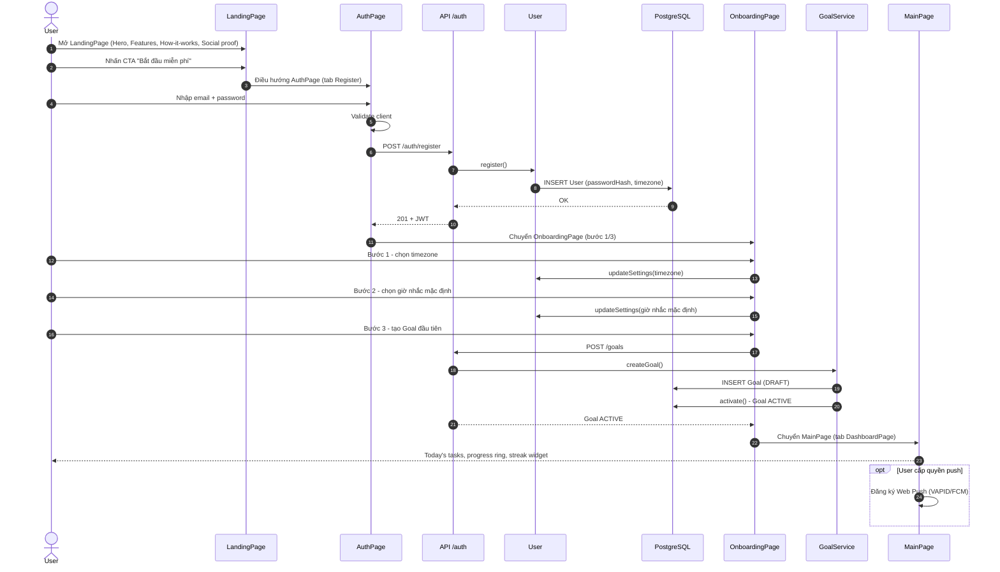
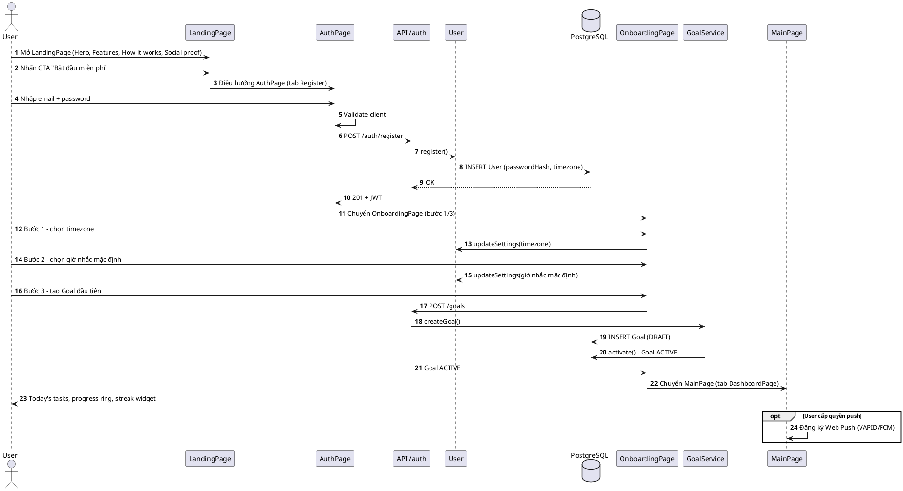
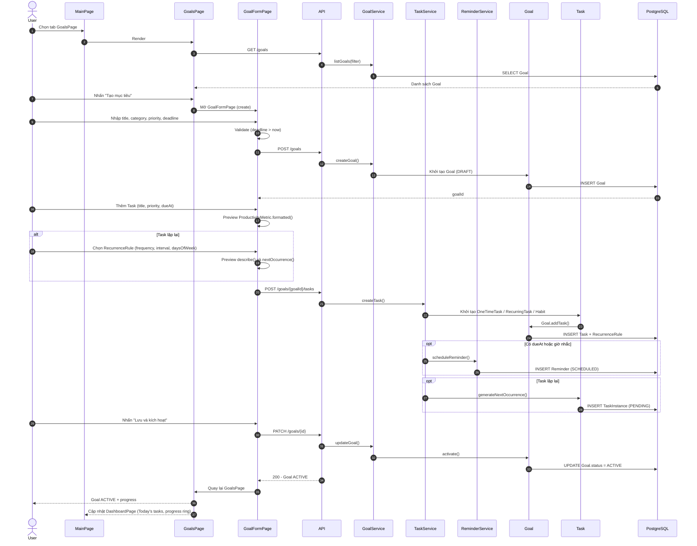
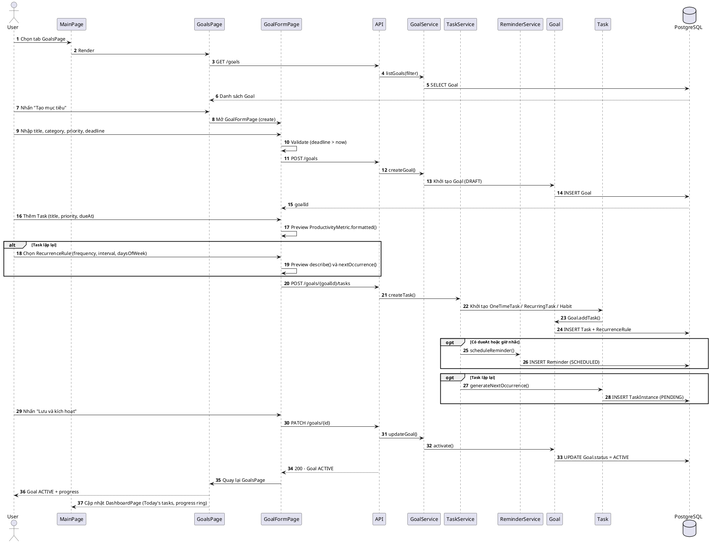
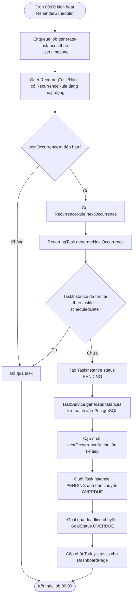
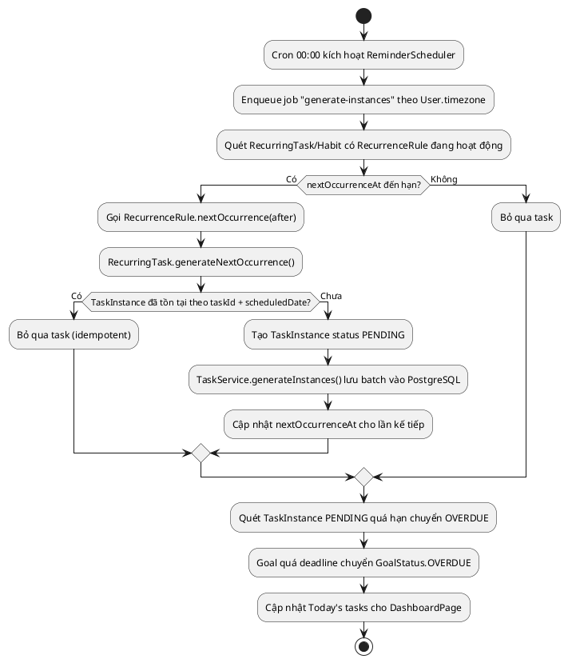
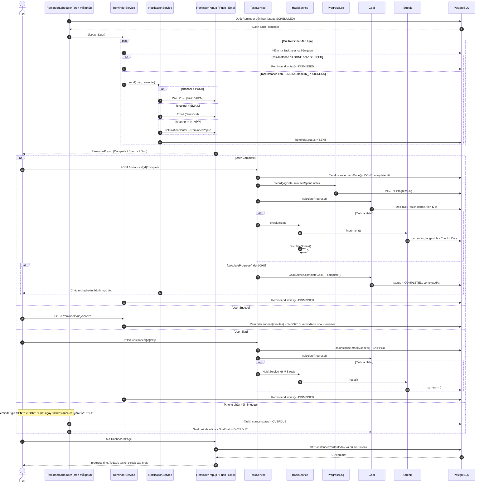
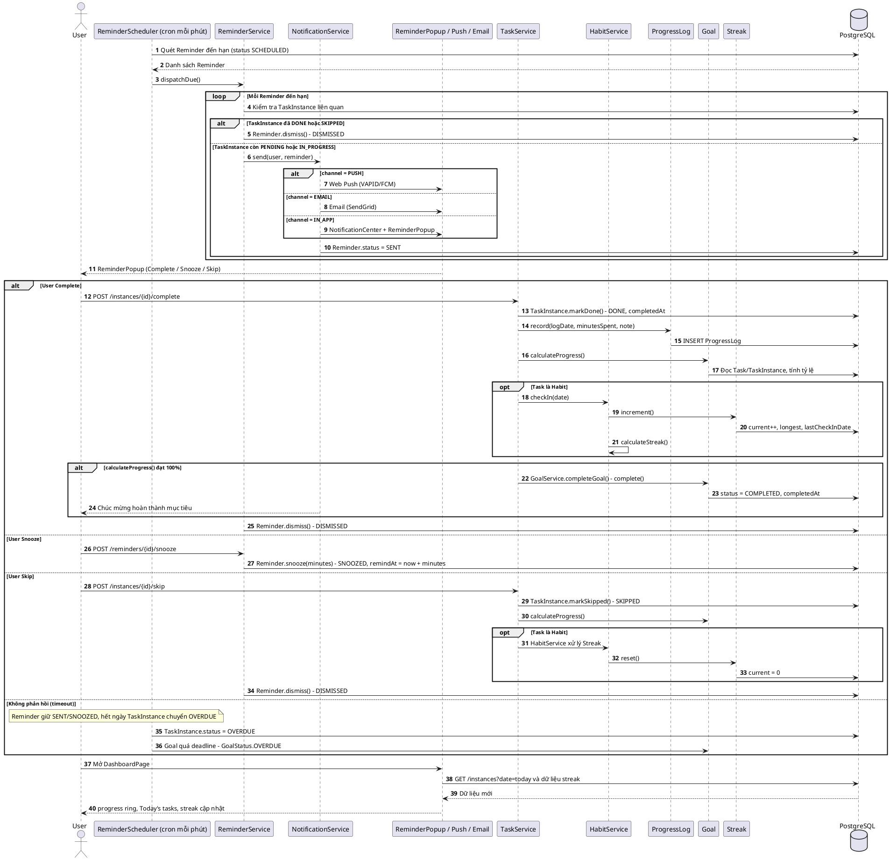
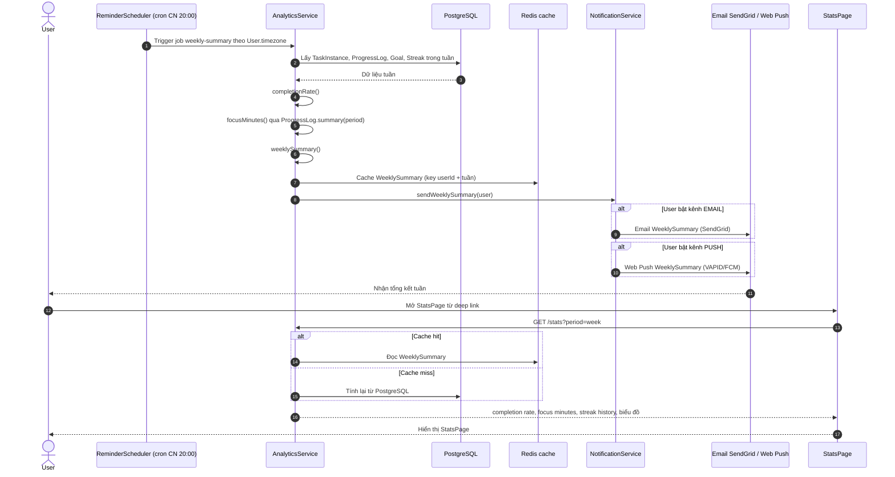
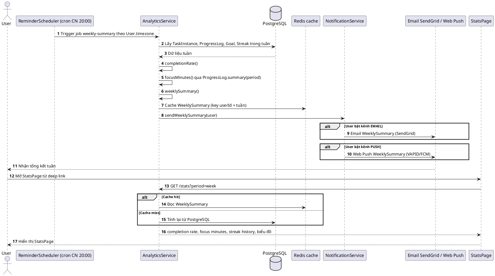

# Workflow hệ thống — Goal Habit Manager (GHM)

Tài liệu này đặc tả **5 workflow chính** của hệ thống **Goal Habit Manager (GHM)** theo mục 5 của spec chuẩn. Mỗi workflow gồm: mô tả, Actor chính, Preconditions, Main Flow (đánh số bước, ghi rõ service/class tham gia), Alternative/Exception Flow và Postconditions. Các sơ đồ quan trọng được vẽ **cả Mermaid lẫn PlantUML** trong hai code block liền nhau, kèm chú thích ngắn bên dưới.

Luồng dữ liệu tổng quát: `Client → API → Service → Repository → DB`; `ReminderScheduler → Service → NotificationService → Push/Email/In-app`; `Client nhận push → mở app → gọi API`.

---

## Workflow 1 — Onboarding & Đăng ký

### Mô tả
Workflow đưa người dùng mới từ **LandingPage** qua **AuthPage** (Register), xác thực và khởi tạo tài khoản, sau đó dẫn qua **OnboardingPage** (3 bước: chọn timezone, giờ nhắc mặc định, tạo Goal đầu tiên) và kết thúc tại **MainPage** (App Shell, tab **DashboardPage**). Đây là workflow mở đầu, đảm bảo `User` có đủ cấu hình tối thiểu để các workflow 2–5 hoạt động đúng theo timezone và kênh thông báo.

### Actor chính
- **User** (người dùng mới, chưa có tài khoản).
- Hệ thống tham gia: API auth (JWT), `User`, `GoalService`.

### Preconditions
- User có trình duyệt hỗ trợ SPA/PWA, truy cập được **LandingPage**.
- Email đăng ký chưa tồn tại trong hệ thống.
- API `/auth` và PostgreSQL hoạt động; `GoalService` sẵn sàng.

### Main Flow
1. User mở **LandingPage**: xem Hero + CTA "Bắt đầu miễn phí", Features (3–4 khối), How-it-works (3 bước), Social proof, Footer (không cần đăng nhập).
2. User nhấn CTA "Bắt đầu miễn phí" → client điều hướng sang **AuthPage** (tab Register).
3. User nhập email + password; **AuthPage** validate phía client (định dạng email, độ mạnh password) rồi gọi API `POST /auth/register`.
4. API gọi `User.register()`: kiểm tra email chưa tồn tại, hash mật khẩu thành `passwordHash`, gán `timezone` mặc định theo trình duyệt, lưu `User` vào PostgreSQL và sinh JWT.
5. Client lưu JWT và chuyển sang **OnboardingPage** (bước 1/3).
6. **Bước 1/3 — chọn timezone:** User chọn timezone; OnboardingPage gọi `User.updateSettings()` để lưu `User.timezone` (cơ sở để `ReminderScheduler` chạy cron theo từng User).
7. **Bước 2/3 — giờ nhắc mặc định:** User chọn giờ nhắc mặc định; OnboardingPage lưu cấu hình qua `User.updateSettings()` (được `ReminderService.scheduleReminder()` dùng lại về sau).
8. **Bước 3/3 — tạo Goal đầu tiên:** User nhập title, priority, deadline; OnboardingPage gọi `POST /goals` → `GoalService.createGoal()` tạo `Goal` (status `GoalStatus.DRAFT`) → `Goal.activate()` chuyển sang `ACTIVE`. User có thể thêm Task nhanh qua `TaskService.createTask()`.
9. Hệ thống chuyển vào **MainPage** (App Shell) và mở tab **DashboardPage**: hiển thị Today's tasks, progress ring, streak widget.
10. Nếu User đồng ý cấp quyền, client đăng ký Web Push (VAPID/FCM) để `NotificationService` dùng kênh `PUSH`; nếu không, kênh `IN_APP` vẫn hoạt động.

### Sơ đồ

*Hình 1 — Sequence diagram Workflow 1 (Onboarding & Đăng ký): LandingPage → AuthPage (Register) → `User.register()` → OnboardingPage 3 bước → MainPage/DashboardPage.*

### Alternative / Exception Flow
- **A1 — Email đã tồn tại:** API trả `409 Conflict`; AuthPage hiển thị lỗi và gợi ý chuyển sang tab Login.
- **A2 — User đã có tài khoản:** dùng tab Login của AuthPage → `User.login()` cấp JWT; bỏ qua Onboarding (timezone đã có) và vào thẳng MainPage.
- **A3 — Bỏ qua bước 2/3:** hệ thống dùng giờ nhắc mặc định; Onboarding vẫn hoàn tất bình thường.
- **A4 — Bỏ qua bước 3/3:** User vào MainPage với empty state; DashboardPage hiển thị CTA tạo Goal đầu tiên.
- **A5 — Quên mật khẩu:** User dùng tab ForgotPassword của AuthPage; hệ thống gửi email đặt lại qua SendGrid.
- **E1 — Password yếu / email sai định dạng:** validate client + server trả `422`; giữ nguyên dữ liệu form và highlight field lỗi.
- **E2 — Mất mạng khi register:** client giữ form cho phép retry; ràng buộc unique email chống tạo `User` trùng.
- **E3 — JWT hết hạn giữa Onboarding:** API trả `401`; client refresh token hoặc quay lại AuthPage; các cấu hình đã lưu ở bước trước vẫn còn.
- **E4 — API/DB lỗi 5xx:** hiển thị thông báo thân thiện, cho phép thử lại; Admin nhận cảnh báo vận hành.

### Postconditions
- Bản ghi `User` tồn tại trong PostgreSQL (email duy nhất, `passwordHash`, `timezone`).
- JWT hợp lệ được lưu phía client, phiên đăng nhập hoạt động.
- `User.timezone` và giờ nhắc mặc định đã được lưu qua `User.updateSettings()`.
- Goal đầu tiên ở status `ACTIVE` (nếu hoàn tất bước 3/3).
- User đang ở **MainPage/DashboardPage**; kênh `IN_APP` sẵn sàng, kênh `PUSH` sẵn sàng nếu User cấp quyền.

---

## Workflow 2 — Tạo mục tiêu

### Mô tả
Workflow cho phép User tạo một `Goal` mới cùng các `Task` (một lần hoặc lặp lại) với đầy đủ thuộc tính priority, effort (`ProductivityMetric`) và `RecurrenceRule`. Điểm kết thúc là Goal chuyển sang `GoalStatus.ACTIVE`, xuất hiện trên GoalsPage/GoalDetailPage và DashboardPage. Đây là workflow tạo dữ liệu nguồn cho Workflow 3 (sinh `TaskInstance`) và Workflow 4 (nhắc nhở & hoàn thành).

### Actor chính
- **User**.
- Hệ thống tham gia: API `/goals`, `/tasks`; `GoalService`, `TaskService`, `ReminderService`; entities `Goal`, `Task`, `OneTimeTask`, `RecurringTask`, `Habit`; value objects `ProductivityMetric`, `RecurrenceRule`.

### Preconditions
- User đã đăng nhập (JWT hợp lệ) và đang ở **MainPage**.
- User có quyền ghi trên Goal của chính mình.
- API `/goals`, `/tasks` và PostgreSQL hoạt động.

### Main Flow
1. User ở **MainPage**, chọn tab **GoalsPage**; GoalsPage gọi `GET /goals` → API → `GoalService.listGoals(filter)` đọc PostgreSQL và render danh sách `Goal` (status, priority, tiến độ).
2. User nhấn "Tạo mục tiêu" → mở **GoalFormPage** (create mode; cùng màn hình dùng cho edit).
3. User nhập title, description, category, priority (`Priority`), deadline; GoalFormPage validate (title bắt buộc, deadline > now).
4. GoalFormPage gọi `POST /goals` → API gọi `GoalService.createGoal()` khởi tạo `Goal` với `GoalStatus.DRAFT`, lưu qua Repository vào PostgreSQL và trả về `goalId`.
5. User thêm Task trong GoalFormPage: title, notes, priority, dueAt, effort = `ProductivityMetric` (estimatedMinutes, energyLevel 1..5, weight); client xem trước `ProductivityMetric.formatted()`.
6. Nếu Task lặp lại: User chọn `RecurrenceRule` (frequency `Frequency`, interval, daysOfWeek, startDate, endDate); client xem trước `RecurrenceRule.describe()` và `RecurrenceRule.nextOccurrence(after)`.
7. GoalFormPage gọi `POST /goals/{goalId}/tasks` → API gọi `TaskService.createTask()` khởi tạo `OneTimeTask` / `RecurringTask` (hoặc `Habit` với `goalType` BUILD/QUIT), gắn vào Goal bằng `Goal.addTask()`, lưu `Task` + `RecurrenceRule` vào PostgreSQL.
8. Với `RecurringTask`/`Habit`: `TaskService.generateInstances()` gọi `RecurringTask.generateNextOccurrence()` sinh `TaskInstance` đầu tiên (status `TaskStatus.PENDING`, `scheduledDate` theo `RecurrenceRule.nextOccurrence()`) và cập nhật `nextOccurrenceAt`.
9. Nếu Task có dueAt/giờ nhắc: `ReminderService.scheduleReminder()` tạo `Reminder` (remindAt, channel theo `User.notificationChannels`, repeatRule) với status `ReminderStatus.SCHEDULED`.
10. User nhấn "Lưu & kích hoạt"; GoalFormPage gọi `PATCH /goals/{id}` → `GoalService.updateGoal()` lưu thay đổi, sau đó `Goal.activate()` chuyển `DRAFT → ACTIVE`.
11. API trả về Goal `ACTIVE`; client quay lại **GoalsPage**/**GoalDetailPage**; DashboardPage refresh Today's tasks và progress ring.
12. Hệ thống ghi nhận Goal cho `Goal.calculateProgress()` và (nếu là `Habit`) khởi tạo `Streak` ban đầu (current = 0, longest = 0).

### Sơ đồ

*Hình 2 — Sequence diagram Workflow 2 (Tạo mục tiêu): GoalFormPage → API → `GoalService`/`TaskService` → `Goal`/`Task` → PostgreSQL, kết thúc bằng `Goal.activate()`.*

### Alternative / Exception Flow
- **A1 — Goal giữ DRAFT:** User lưu nhưng chưa kích hoạt; Goal không tính vào Dashboard, có thể `Goal.activate()` sau từ GoalDetailPage.
- **A2 — Task không lặp:** chỉ tạo `OneTimeTask`, không sinh `TaskInstance` định kỳ, không có `RecurrenceRule`.
- **A3 — Task là Habit:** User chọn `HabitType` BUILD/QUIT; hệ thống khởi tạo `Streak` ban đầu và dùng `HabitService.checkIn()` ở Workflow 4.
- **A4 — Đổi lịch Task:** kéo-thả trên **CalendarPage** → `Task.reschedule(newDate)`; `ReminderService` cập nhật lại `Reminder` tương ứng.
- **A5 — Quick-add:** từ **DashboardPage** nhấn FAB → **TaskFormModal** tạo Task nhanh bằng `TaskService.createTask()` (không tạo Goal mới).
- **E1 — deadline ≤ now hoặc `RecurrenceRule` không hợp lệ** (endDate < startDate, interval ≤ 0): API trả `422`; GoalFormPage highlight field lỗi, không lưu.
- **E2 — Lưu Task thất bại sau khi Goal đã tạo:** transaction rollback phần Task; Goal giữ `DRAFT` và cho phép thử lại.
- **E3 — Mất mạng khi lưu:** client giữ nháp cục bộ (PWA) và retry; chống trùng bản ghi bằng idempotency key phía API.
- **E4 — Goal đã bị ARCHIVED khi đang sửa:** API trả `409`; client thông báo và đưa User về GoalsPage.
- **E5 — `ProductivityMetric` vượt biên:** energyLevel ngoài 1..5 hoặc weight < 0 → `422`, không lưu.

### Postconditions
- `Goal` và các `Task` (+ `RecurrenceRule`, `TaskInstance` đầu tiên nếu lặp) đã lưu trong PostgreSQL.
- Goal status = `ACTIVE`, hiển thị trên GoalsPage/GoalDetailPage và DashboardPage.
- `Reminder` ở status `SCHEDULED` cho các Task có giờ nhắc.
- `Goal.calculateProgress()` bắt đầu được sử dụng để tính tiến độ; `Streak` tồn tại nếu là `Habit`.

---

## Workflow 3 — Sinh nhiệm vụ lặp lại

### Mô tả
Workflow chạy nền hằng ngày lúc **00:00** (theo timezone từng User): `ReminderScheduler` quét `RecurringTask`/`Habit` có `RecurrenceRule` đến hạn, sinh `TaskInstance` cho ngày/tuần tương ứng, đánh dấu các instance quá hạn là `OVERDUE` và cập nhật dữ liệu cho **DashboardPage**. Workflow này đảm bảo "Hôm nay" luôn có sẵn danh sách nhiệm vụ trước khi User mở app.

### Actor chính
- **Scheduler / Reminder Engine** (`ReminderScheduler`, tác nhân hệ thống, chạy nền).
- Hệ thống tham gia: `TaskService`, `HabitService`; entities `RecurringTask`, `Habit`, `TaskInstance`, `Goal`; value object `RecurrenceRule`.

### Preconditions
- Tồn tại `RecurringTask`/`Habit` đang hoạt động với `RecurrenceRule` và `nextOccurrenceAt` đến hạn.
- Worker `ReminderScheduler` + Redis job queue (BullMQ/Celery) hoạt động; PostgreSQL truy cập được.
- `User.timezone` đã được thiết lập từ Workflow 1.

### Main Flow
1. Cron **00:00** kích hoạt `ReminderScheduler` (worker chạy nền qua Redis job queue).
2. Scheduler enqueue job `generate-instances`, nhóm theo `User.timezone` để xác định đúng ngày lịch.
3. Với mỗi `RecurringTask`/`Habit` đang hoạt động: đọc `RecurrenceRule` và gọi `RecurrenceRule.nextOccurrence(after)` để kiểm tra hôm nay có phải ngày lặp.
4. Nếu đến hạn: `RecurringTask.generateNextOccurrence()` tạo `TaskInstance` mới với `taskId`, `scheduledDate`, status `TaskStatus.PENDING`.
5. `TaskService.generateInstances()` lưu batch `TaskInstance` vào PostgreSQL (idempotent theo cặp `taskId` + `scheduledDate`).
6. Scheduler cập nhật `nextOccurrenceAt` cho lần lặp kế tiếp; nếu `RecurrenceRule` đã quá `endDate` thì dừng vòng lặp.
7. Scheduler quét các `TaskInstance` còn `PENDING` của ngày cũ → chuyển `TaskStatus.OVERDUE`; `Goal` quá deadline → `GoalStatus.OVERDUE`.
8. Scheduler tính toán lại dữ liệu Today's tasks cho từng `User`; khi User mở app, **DashboardPage** gọi `GET /instances?date=today` để hiển thị.
9. Với `Habit`: `TaskInstance` mới xuất hiện trên **HabitsPage/HabitDetailPage** (calendar heatmap) sẵn sàng cho `HabitService.checkIn()`.
10. Kết thúc job; ghi log số instance đã sinh và số instance chuyển `OVERDUE`.

### Sơ đồ

*Hình 3 — Activity diagram Workflow 3 (Sinh nhiệm vụ lặp lại): cron 00:00 → quét `RecurrenceRule` → tạo `TaskInstance` → cập nhật DashboardPage.*

### Alternative / Exception Flow
- **A1 — Không có task đến hạn:** job kết thúc ngay, không sinh `TaskInstance` nào.
- **A2 — `RecurrenceRule` đã hết `endDate`:** dừng vòng lặp, không sinh instance mới (không thêm trạng thái mới).
- **A3 — Task bị xóa hoặc Goal `ARCHIVED`:** bỏ qua task khi quét.
- **E1 — Job retry gây trùng lặp:** ràng buộc unique (`taskId`, `scheduledDate`) đảm bảo idempotent, không tạo `TaskInstance` trùng.
- **E2 — Worker chết giữa chừng:** job được retry bởi Redis job queue (BullMQ/Celery); các instance đã lưu không bị nhân đôi.
- **E3 — User đổi timezone:** `scheduledDate` tính theo `User.timezone` mới nhất; nếu đổi qua ngày mới, chỉ sinh bù tối đa một lần nhờ khóa idempotent.
- **E4 — PostgreSQL tạm thời không truy cập được:** job retry theo backoff; ghi log và cảnh báo Admin.
- **E5 — Máy chủ lệch giờ (clock skew):** Scheduler dùng UTC nội bộ + timezone từng User để tránh sinh sai ngày.

### Postconditions
- Các `TaskInstance` status `PENDING` cho ngày mới đã tồn tại trong PostgreSQL.
- Các `TaskInstance` cũ không hoàn thành đã chuyển `OVERDUE`; `Goal` quá deadline → `GoalStatus.OVERDUE`.
- `nextOccurrenceAt` của `RecurringTask`/`Habit` đã cập nhật cho lần kế tiếp.
- **DashboardPage** hiển thị Today's tasks mới khi User mở app; **HabitsPage** sẵn sàng check-in.

---

## Workflow 4 — Vòng lặp nhắc nhở & hoàn thành (workflow trung tâm)

### Mô tả
Workflow trung tâm của GHM, chạy liên tục: `ReminderScheduler` cron **mỗi phút** quét `Reminder` đến hạn → `ReminderService.dispatchDue()` → `NotificationService` gửi qua `ReminderPopup`/Push/Email → User phản hồi **Complete / Snooze / Skip** (hoặc không phản hồi) → ghi `ProgressLog.record()` → `Goal.calculateProgress()` và `Streak.increment()`/`Streak.reset()` → nếu Goal đạt 100% thì `Goal.complete()` (`GoalStatus.COMPLETED`) kèm chúc mừng. Đây là vòng lặp đảm bảo mục tiêu sản phẩm: hình thành thói quen quản lý mục tiêu.

### Actor chính
- **Scheduler / Reminder Engine** (`ReminderScheduler`).
- **NotificationService** (tác nhân hệ thống).
- **User** (tác nhân quyết định Complete/Snooze/Skip).
- Hệ thống tham gia: `ReminderService`, `TaskService`, `HabitService`, `NotificationService`, `GoalService`; entities `Reminder`, `TaskInstance`, `Task`, `Habit`, `ProgressLog`, `Goal`, `Streak`.

### Preconditions
- Tồn tại `Reminder` status `ReminderStatus.SCHEDULED` với `remindAt` đến hạn.
- `TaskInstance`/`Task` liên quan chưa `DONE`/`SKIPPED`; Goal chưa `ARCHIVED`.
- User đã đăng nhập (hoặc nhận được Push/Email); kênh thông báo khả dụng.
- Worker Scheduler và Redis job queue hoạt động.

### Main Flow
1. `ReminderScheduler` (cron mỗi phút) quét PostgreSQL tìm `Reminder` có `remindAt` đến hạn và status `SCHEDULED`.
2. Scheduler gọi `ReminderService.dispatchDue()`; service lọc bỏ Reminder mà `TaskInstance` đã `DONE`/`SKIPPED` hoặc `Goal` đã `ARCHIVED`.
3. Với mỗi Reminder còn hiệu lực: `ReminderService` gọi `NotificationService.send(user, reminder)`.
4. `NotificationService` chọn kênh theo `Reminder.channel` / `User.notificationChannels`: `IN_APP` → NotificationCenter + **ReminderPopup**; `PUSH` → Web Push (VAPID/FCM); `EMAIL` → SendGrid.
5. Gửi thành công: `Reminder.status = ReminderStatus.SENT` và lưu DB; gửi lỗi: `ReminderStatus.FAILED` rồi fallback (xem mục Xử lý lỗi).
6. Client hiển thị **ReminderPopup** với 3 hành động: Complete / Snooze / Skip.
7. **User Complete:** client gọi `POST /instances/{id}/complete` → `TaskService.completeTask()` → `TaskInstance.markDone()` (status `DONE`, ghi `completedAt`).
8. `TaskService` gọi `ProgressLog.record()` tạo `ProgressLog` (`logDate`, `minutesSpent` lấy từ `ProductivityMetric.estimatedMinutes` hoặc nhập tay, `note`).
9. `Goal.calculateProgress()` tính lại tiến độ Goal (tỷ lệ `TaskInstance` DONE trên tổng, có thể theo trọng số `ProductivityMetric.weight`).
10. Nếu Task thuộc `Habit`: `HabitService.checkIn(date)` → `Streak.increment()` (current++, cập nhật `longest`, `lastCheckInDate`) và `HabitService.calculateStreak()`.
11. Nếu `Goal.calculateProgress()` đạt 100%: `GoalService.completeGoal()` → `Goal.complete()` → `GoalStatus.COMPLETED`, ghi `completedAt`; `NotificationService` gửi lời chúc mừng (IN_APP/PUSH).
12. Reminder của lần nhắc đó → `Reminder.dismiss()` (status `DISMISSED`).
13. **User Snooze:** client gọi `POST /reminders/{id}/snooze` → `ReminderService.snooze(minutes)` → `Reminder.snooze(minutes)` đặt `remindAt = now + minutes`, status `SNOOZED`; Scheduler sẽ nhắc lại; **không** ghi `ProgressLog`.
14. **User Skip:** client gọi `POST /instances/{id}/skip` → `TaskService` gọi `Task.skip()` / `TaskInstance.markSkipped()` (status `SKIPPED`); nếu là `Habit` → `Streak.reset()` (current = 0, `isActive()` = false); `Goal.calculateProgress()` cập nhật; Reminder → `DISMISSED`.
15. **Không phản hồi:** Reminder giữ `SENT`/`SNOOZED`; hết ngày, `TaskInstance` → `OVERDUE`; `Habit` chưa check-in qua ngày → `Streak.reset()` khi `HabitService.calculateStreak()` chạy; `Goal` quá deadline → `GoalStatus.OVERDUE`.
16. Sau mỗi sự kiện, client refresh **DashboardPage** (progress ring, streak widget); Reminder kế tiếp được `ReminderService.scheduleReminder()` lên lịch và vòng lặp quay lại bước 1.

### Sơ đồ

*Hình 4 — Sequence diagram Workflow 4 (Vòng lặp nhắc nhở & hoàn thành): Scheduler mỗi phút → `ReminderService.dispatchDue()` → `NotificationService` → `ReminderPopup`/Push → User phản hồi → `ProgressLog.record()` → `Goal.calculateProgress()` + `Streak` → Goal `COMPLETED`.*

### Bảng xử lý sự kiện

| Sự kiện | Hành động client/API | Service & class xử lý | `TaskInstance` | `Reminder` | `ProgressLog` | `Goal` / `Streak` | Hậu quả UI |
|---|---|---|---|---|---|---|---|
| **Complete** | `POST /instances/{id}/complete` | `TaskService.completeTask()`, `TaskInstance.markDone()` | `DONE` + `completedAt` | `DISMISSED` | `record()` tạo 1 bản ghi | `Goal.calculateProgress()` tăng; `Habit` → `Streak.increment()` | Progress ring tăng, streak +1; nếu 100% → chúc mừng, Goal `COMPLETED` |
| **Snooze** | `POST /reminders/{id}/snooze` | `ReminderService.snooze()`, `Reminder.snooze(minutes)` | Giữ nguyên (`PENDING`/`IN_PROGRESS`) | `SNOOZED`, `remindAt = now + minutes` | Không ghi | Không đổi | Popup đóng, hẹn nhắc lại sau N phút |
| **Skip** | `POST /instances/{id}/skip` | `TaskService`, `Task.skip()`, `TaskInstance.markSkipped()` | `SKIPPED` | `DISMISSED` | Không ghi | `Goal.calculateProgress()` không tăng; `Habit` → `Streak.reset()` | Task rời Today's tasks, streak về 0 |
| **Không phản hồi (timeout)** | Không có request | `ReminderScheduler` + `ReminderService.dispatchDue()` | `OVERDUE` (khi hết ngày) | Giữ `SENT`/`SNOOZED` (hoặc `FAILED` nếu gửi lỗi) | Không ghi | Goal quá deadline → `GoalStatus.OVERDUE`; `Habit` → `Streak.reset()` | Badge overdue, nhắc lại theo `repeatRule` |

*Bảng 4.1 — Bốn sự kiện chính của vòng lặp nhắc nhở và hậu quả tương ứng trên entities/enums.*

### Alternative / Exception Flow
- **A1 — Complete khi Goal đã đủ điều kiện:** `Goal.calculateProgress()` đạt 100% → `GoalService.completeGoal()`; các Task khác của Goal vẫn giữ nguyên trạng thái.
- **A2 — Snooze nhiều lần:** mỗi lần `Reminder.snooze(minutes)` đẩy `remindAt` xa hơn; không tạo `Reminder` mới, không ghi `ProgressLog`.
- **A3 — Complete một `Habit` đã `Streak.reset()` trước đó:** `Streak.increment()` bắt đầu chuỗi mới (current = 1), `longest` giữ giá trị lớn nhất lịch sử.
- **A4 — Reminder không còn cần thiết:** `TaskInstance` đã `DONE`/`SKIPPED` hoặc Goal `ARCHIVED` → `dispatchDue()` chuyển Reminder `DISMISSED`, không gửi.
- **E1 — Push fail:** `NotificationService` fallback `IN_APP`; `Reminder.status = FAILED` rồi reschedule theo `repeatRule` (xem mục Xử lý lỗi).
- **E2 — User đổi timezone giữa chu kỳ:** `remindAt` được tính lại theo `User.timezone` mới; không nhân đôi Reminder đã `SENT`.
- **E3 — Nhiều Reminder trùng giờ:** `dispatchDue()` xử lý tuần tự theo `remindAt`; client gộp hiển thị trong một **ReminderPopup** (nhóm) hoặc lần lượt.
- **E4 — Client mất mạng khi Complete:** optimistic UI + retry queue; API idempotent theo `TaskInstance.id` nên `markDone()` lặp không sinh `ProgressLog` trùng.
- **E5 — `Reminder` gửi lỗi liên tiếp:** chuyển `FAILED`, dừng retry vô hạn, ghi log để Admin theo dõi.

### Postconditions
- `TaskInstance` ở trạng thái `DONE`/`SKIPPED`/`OVERDUE` tương ứng với sự kiện.
- `ProgressLog` được ghi cho mỗi lần Complete; `minutesSpent` phục vụ `AnalyticsService.focusMinutes()`.
- `Reminder` ở trạng thái `SENT`/`SNOOZED`/`DISMISSED`/`FAILED` đúng vòng đời.
- `Goal.calculateProgress()` phản ánh tiến độ mới; Goal đạt 100% → `GoalStatus.COMPLETED` + chúc mừng.
- `Habit` cập nhật `Streak` (`increment()` khi check-in, `reset()` khi skip/bỏ lỡ).
- DashboardPage/HabitDetailPage hiển thị progress ring, Today's tasks và streak mới nhất.

---

## Workflow 5 — Tổng kết tuần

### Mô tả
Workflow định kỳ **Chủ nhật 20:00** (theo timezone từng User): `AnalyticsService` tổng hợp dữ liệu tuần (`completionRate()`, `focusMinutes()`, `weeklySummary()`) → cache Redis → `NotificationService.sendWeeklySummary()` gửi email/push → User mở **StatsPage** xem completion rate, focus minutes, streak history và biểu đồ. Workflow khép kín vòng phản hồi, giúp User duy trì thói quen qua số liệu.

### Actor chính
- **Scheduler / Reminder Engine** (`ReminderScheduler`, trigger cron).
- **AnalyticsService** (tác nhân hệ thống, tổng hợp).
- **NotificationService** (tác nhân hệ thống, gửi WeeklySummary).
- **User** (xem StatsPage).

### Preconditions
- Tồn tại dữ liệu trong tuần: `TaskInstance`, `ProgressLog`, `Goal`, `Streak` của User.
- `AnalyticsService` và API `/stats` hoạt động; Redis + PostgreSQL truy cập được.
- User chưa tắt hết kênh EMAIL/PUSH (nếu tắt, chỉ xem in-app).

### Main Flow
1. `ReminderScheduler` (cron Chủ nhật 20:00, theo `User.timezone`) enqueue job `weekly-summary` cho từng User đang hoạt động qua Redis job queue.
2. `AnalyticsService.weeklySummary(user, week)` tổng hợp dữ liệu tuần từ `TaskInstance`, `ProgressLog`, `Goal`, `Streak`.
3. `AnalyticsService.completionRate()` tính tỷ lệ hoàn thành (số `TaskInstance` DONE trên tổng trong tuần, SKIPPED không tính là hoàn thành).
4. `AnalyticsService.focusMinutes()` cộng `minutesSpent` qua `ProgressLog.summary(period)`.
5. Kết quả được cache trong Redis (key `userId` + tuần) để **StatsPage** đọc nhanh; API `GET /stats?period=week` trả dữ liệu.
6. `NotificationService.sendWeeklySummary(user)` gửi `EMAIL` (SendGrid) và/hoặc `PUSH` (VAPID/FCM) theo `User.notificationChannels`; nội dung: completion rate, focus minutes, streak history, điểm nổi bật.
7. User nhận email/push → deep link mở **StatsPage**.
8. **StatsPage** hiển thị completion rate, focus minutes, streak history và biểu đồ; gọi `/stats` (đọc cache, tính lại nếu cache miss).
9. User có thể nhấn vào Goal/Streak để điều hướng sang **GoalDetailPage**/**HabitDetailPage**.
10. Job ghi log kết quả gửi và đánh dấu tuần đã tổng kết (không gửi lặp).

### Sơ đồ

*Hình 5 — Sequence diagram Workflow 5 (Tổng kết tuần): cron Chủ nhật 20:00 → `AnalyticsService.weeklySummary()` → cache Redis → `NotificationService.sendWeeklySummary()` → email/push → StatsPage.*

### Alternative / Exception Flow
- **A1 — User tắt cả EMAIL và PUSH:** không gửi thông báo; WeeklySummary vẫn có trong Redis/NotificationCenter để User xem khi mở **StatsPage**.
- **A2 — Tuần không có dữ liệu:** StatsPage hiển thị empty state; email summary rỗng có thể bỏ qua theo cấu hình.
- **A3 — Cache miss:** `AnalyticsService` tính lại trực tiếp từ PostgreSQL, sau đó ghi lại Redis.
- **E1 — SendGrid lỗi/bounce:** retry theo backoff, fallback `PUSH` → `IN_APP`.
- **E2 — Web Push fail (token hết hạn/quyền bị thu hồi):** fallback `IN_APP`; xóa token không hợp lệ để `NotificationService` không gửi lại.
- **E3 — Job timeout khi đông User:** chia batch qua Redis job queue (BullMQ/Celery), retry idempotent theo key `userId` + tuần, tránh gửi trùng.
- **E4 — User đổi timezone sát 20:00:** dùng `User.timezone` mới nhất; khóa idempotent chống gửi 2 lần.
- **E5 — Redis lỗi:** `AnalyticsService` tính trực tiếp từ PostgreSQL (chậm hơn); StatsPage vẫn hoạt động.

### Postconditions
- WeeklySummary được cache trong Redis và gắn cờ tuần đã tổng kết (không gửi lặp).
- User nhận email/push WeeklySummary nếu bật kênh; nếu không, xem được trong NotificationCenter/StatsPage.
- **StatsPage** hiển thị completion rate, focus minutes, streak history và biểu đồ.
- Kết quả tuần phản ánh đúng dữ liệu `TaskInstance`/`ProgressLog`/`Goal`/`Streak` của User.

---

## Ma trận Workflow ↔ Use Case ↔ Màn hình

| # | Workflow | Use Case chính | Màn hình / Overlay | Service & Class chính | API endpoint |
|---|---|---|---|---|---|
| 1 | Onboarding & Đăng ký | UC-01 Đăng ký, UC-02 Đăng nhập, UC-03 Onboarding | LandingPage → AuthPage → OnboardingPage → MainPage (DashboardPage) | `User`, `GoalService`, `TaskService` | `/auth`, `/goals` |
| 2 | Tạo mục tiêu | UC-04 Tạo Goal, UC-05 Tạo Task, UC-06 Cấu hình RecurrenceRule, UC-07 Kích hoạt Goal | MainPage → GoalsPage → GoalFormPage → GoalDetailPage; TaskFormModal | `GoalService`, `TaskService`, `ReminderService`, `Goal`, `Task`, `ProductivityMetric`, `RecurrenceRule` | `/goals`, `/tasks`, `/reminders` |
| 3 | Sinh nhiệm vụ lặp lại | UC-08 Sinh TaskInstance định kỳ, UC-09 Theo dõi Today's tasks | DashboardPage, HabitsPage/HabitDetailPage (calendar heatmap) | `ReminderScheduler`, `TaskService`, `HabitService`, `RecurringTask`, `Habit`, `RecurrenceRule`, `TaskInstance` | (nội bộ job), `/instances` |
| 4 | Vòng lặp nhắc nhở & hoàn thành | UC-10 Nhận nhắc nhở, UC-11 Complete Task, UC-12 Snooze, UC-13 Skip, UC-14 Check-in Habit, UC-15 Theo dõi Streak | ReminderPopup, NotificationCenter, DashboardPage, HabitDetailPage | `ReminderScheduler`, `ReminderService`, `NotificationService`, `TaskService`, `HabitService`, `ProgressLog`, `Goal`, `Streak`, `Reminder` | `/reminders`, `/instances`, `/habits` |
| 5 | Tổng kết tuần | UC-16 Xem thống kê, UC-17 Nhận WeeklySummary | StatsPage; email/push deep link tới StatsPage | `ReminderScheduler`, `AnalyticsService`, `NotificationService`, `ProgressLog` | `/stats` |

*Bảng 5.1 — Ánh xạ 5 workflow với use case, màn hình/overlay và service/class theo spec.*

## Xử lý lỗi & ngoại lệ

| Tình huống | Cách xử lý |
|---|---|
| **Push fail** (quyền bị từ chối, token hết hạn, VAPID/FCM lỗi) | `NotificationService` fallback `IN_APP`: ghi NotificationCenter + hiển thị **ReminderPopup** khi User mở app; `Reminder.status = FAILED`, reschedule theo `repeatRule` nếu còn hiệu lực |
| **User đổi timezone** | Mọi cron (`ReminderScheduler`, 00:00, CN 20:00) và `remindAt` tính lại theo `User.timezone` mới nhất; khóa idempotent đảm bảo không gửi/nhắc trùng; `scheduledDate` sinh bù tối đa một lần |
| **Reminder trùng giờ** | `ReminderService.dispatchDue()` xử lý tuần tự theo `remindAt`; client gộp các Reminder cùng thời điểm vào một **ReminderPopup** (nhóm) hoặc hiển thị lần lượt |
| **Email gửi thất bại** (SendGrid 5xx/bounce) | Retry theo backoff; fallback `PUSH` → `IN_APP`; ghi log để Admin theo dõi |
| **Job 00:00 / WeeklySummary chết giữa chừng** | Retry idempotent qua Redis job queue (BullMQ/Celery) với khóa `userId` + ngày/tuần; unique (`taskId`, `scheduledDate`) chống sinh trùng `TaskInstance` |
| **Client mất mạng khi Complete/Skip** | Optimistic UI + retry queue; API idempotent theo `TaskInstance.id`, không sinh `ProgressLog` trùng khi `markDone()` lặp |
| **JWT hết hạn giữa workflow** | API trả `401`; client refresh token hoặc điều hướng AuthPage; dữ liệu form/nháp được giữ lại |
| **deadline/`RecurrenceRule`/`ProductivityMetric` không hợp lệ** | Server trả `422`; GoalFormPage highlight field lỗi, giữ nguyên dữ liệu để User sửa |
| **Reminder đến hạn nhưng `TaskInstance` đã `DONE`/`SKIPPED`** | `dispatchDue()` bỏ qua và chuyển Reminder `DISMISSED`; không gửi thông báo |
| **`RecurrenceRule` hết `endDate`** | Không sinh `TaskInstance` mới; task đóng vòng lặp, không thêm trạng thái mới ngoài spec |
| **Goal bị `ARCHIVED`/xóa khi Reminder đang chờ** | Reminder chuyển `DISMISSED`, không gửi; Scheduler bỏ qua task khi quét |
| **PostgreSQL/Redis tạm thời không truy cập được** | Job retry theo backoff, cảnh báo Admin; StatsPage có thể tính lại từ PostgreSQL khi Redis lỗi; client hiển thị thông báo thân thiện |
| **Máy chủ lệch giờ (clock skew)** | Scheduler dùng UTC nội bộ + timezone từng User; kiểm tra chênh lệch đồng hồ trước khi dispatch |
| **User bỏ qua Onboarding một phần** | Hệ thống dùng giá trị mặc định (timezone trình duyệt, giờ nhắc mặc định); DashboardPage hiển thị empty state + CTA |

*Bảng 6.1 — Các tình huống lỗi/ngoại lệ thường gặp và cách xử lý tương ứng.*

---

## Liên kết

- [01 — Tổng quan hệ thống](./01-tong-quan-he-thong.md)
- [02 — Mô hình hướng đối tượng](./02-mo-hinh-huong-doi-tuong.md)
- [04 — Lược màn hình](./04-luot-man-hinh.md)
- [05 — Kiến trúc và vận hành](./05-kien-truc-va-van-hanh.md)
