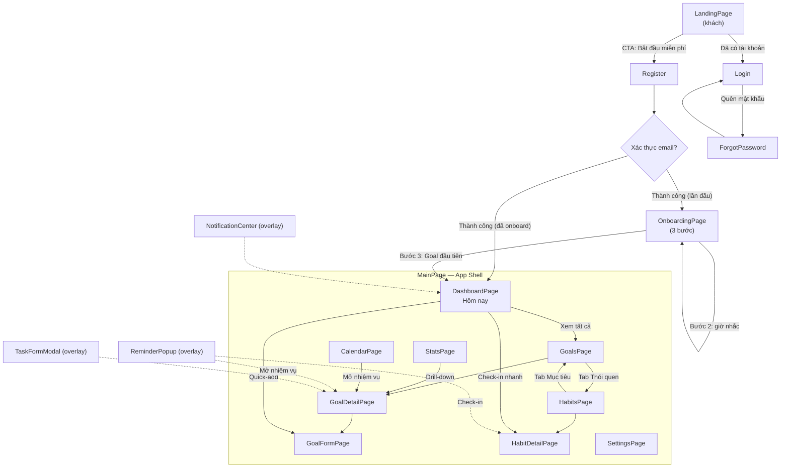
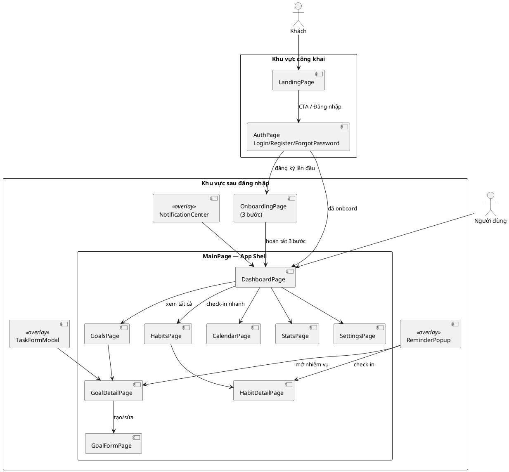

# 04 — Luồng màn hình (LandingPage → MainPage)

Tài liệu này đặc tả cấu trúc màn hình và luồng điều hướng của PerGoal, từ **LandingPage** (khách chưa đăng nhập) → **AuthPage** → **OnboardingPage** → **MainPage** (App Shell với 6 tab chức năng) cùng các overlay như ReminderPopup, NotificationCenter, TaskFormModal.

**Nguyên tắc thiết kế UI:**
- *Progressive onboarding*: khách chỉ cần 1 CTA để bắt đầu; người dùng mới hoàn thành cấu hình tối thiểu (timezone + goal đầu tiên) ngay trong Onboarding.
- *Một hành động chính trên mỗi màn hình*: Dashboard nổi bật "Hôm nay", GoalForm nổi bật "Lưu mục tiêu", HabitDetail nổi bật "Check-in".
- *Mobile-first*: bottom-nav 5 mục + FAB thay cho sidebar trên màn hình nhỏ.
- *Reminder không chặn luồng*: ReminderPopup là overlay có thể Snooze/Dismiss, không ép điều hướng.

---

## 1. Sitemap & luồng điều hướng



*Hình 1a — Sitemap dạng flowchart: toàn bộ màn hình của PerGoal và các cạnh điều hướng chính; overlay được vẽ nét đứt vì không nằm trong cây page.*



*Hình 1b — Sitemap dạng PlantUML: thể hiện rõ actor `Khách`/`Người dùng`, khu vực công khai vs sau đăng nhập, và 3 overlay (ReminderPopup, NotificationCenter, TaskFormModal).*

---

## 2. Đặc tả từng màn hình

### 2.1 LandingPage

| Thành phần UI | Nội dung | Dữ liệu nguồn (class/service) | Hành động & điều hướng |
|---|---|---|---|
| Header | Logo PerGoal, nav (Tính năng / Cách hoạt động / Đăng nhập), CTA "Bắt đầu miễn phí" | Tĩnh | CTA → `AuthPage` (tab Register); "Đăng nhập" → `AuthPage` (tab Login) |
| Hero | Headline "Biến mục tiêu thành thói quen", sub-headline, 2 CTA, ảnh minh họa Dashboard | Tĩnh (ảnh mock từ DashboardPage) | CTA chính → `AuthPage`; CTA phụ "Xem demo" → anchor `#features` |
| Features (4 khối) | (1) Mục tiêu có độ ưu tiên, (2) Nhiệm vụ lặp lại & Habit, (3) Nhắc nhở thông minh, (4) Thống kê tiến độ | Tĩnh, mô tả `Goal`, `RecurringTask`/`Habit`, `Reminder`, `AnalyticsService` | Không điều hướng, chỉ cuộn |
| How-it-works (3 bước) | 1. Tạo mục tiêu → 2. Chia nhiệm vụ & đặt nhắc nhở → 3. Hoàn thành, giữ streak | Luồng workflow 2 & 4 | Anchor `#how` |
| Social proof | Số người dùng, testimonial, logo báo chí | Giả lập (mock) | — |
| Footer | Điều khoản, Chính sách bảo mật, Liên hệ, mạng xã hội | Tĩnh | Liên kết ngoài |

### 2.2 AuthPage (Login / Register / ForgotPassword)

| Thành phần UI | Nội dung | Dữ liệu nguồn (class/service) | Hành động & điều hướng |
|---|---|---|---|
| Tab switcher | 3 tab: Đăng nhập / Đăng ký / Quên mật khẩu | — | Chuyển tab không load lại trang |
| Form Login | Email, Mật khẩu, "Ghi nhớ", nút Đăng nhập | `User.login()` | Thành công → `OnboardingPage` (lần đầu) hoặc `DashboardPage`; lỗi → inline error |
| Form Register | Email, Mật khẩu, Xác nhận mật khẩu, checkbox điều khoản | `User.register()` | Thành công → gửi email xác thực → `OnboardingPage` |
| Form ForgotPassword | Email, nút "Gửi liên kết đặt lại" | `User` + email service | Hiển thị thông báo check email, quay lại tab Login |
| SSO | Nút Google/Apple (v2) | — | (mở rộng v2) |

### 2.3 OnboardingPage (3 bước)

| Thành phần UI | Nội dung | Dữ liệu nguồn (class/service) | Hành động & điều hướng |
|---|---|---|---|
| Progress indicator | 3 chấm tiến trình | — | — |
| Bước 1 — Timezone | Dropdown timezone mặc định theo thiết bị | `User.timezone` | "Tiếp tục" → bước 2 |
| Bước 2 — Kênh & giờ nhắc | Chọn kênh (IN_APP/PUSH/EMAIL), giờ nhắc mặc định (ví dụ 20:00) | `User.notificationChannels`, `Reminder` | "Tiếp tục" → bước 3 |
| Bước 3 — Goal đầu tiên | Nhập title, chọn `Priority`, deadline (tùy chọn), gợi ý mẫu | `GoalService.createGoal()` | "Hoàn tất" → tạo Goal trạng thái ACTIVE → `DashboardPage`; "Để sau" → `DashboardPage` với empty state |

### 2.4 DashboardPage ("Hôm nay")

| Thành phần UI | Nội dung | Dữ liệu nguồn (class/service) | Hành động & điều hướng |
|---|---|---|---|
| Progress ring | % hoàn thành nhiệm vụ hôm nay | `TaskInstance` theo `scheduledDate` = hôm nay | Nhấn → `StatsPage` |
| Today's tasks | Danh sách TaskInstance hôm nay: title, Goal cha, `Priority` badge, `ProductivityMetric.formatted()`, checkbox hoàn thành | `TaskService`, `TaskInstance`, `Goal` | Tick → `TaskInstance.markDone()` → `ProgressLog.record()` → cập nhật ring; nhấn item → `GoalDetailPage` |
| Streak widget | Chuỗi streak hiện tại của các Habit | `Habit.getStreak()` | Nhấn → `HabitDetailPage` |
| Quick-add FAB | Nút "+"Thêm mục tiêu / nhiệm vụ nhanh | `GoalService.createGoal()`, `TaskService.createTask()` | → `GoalFormPage` hoặc `TaskFormModal` |
| Goal nổi bật | 2-3 Goal ACTIVE gần deadline nhất | `GoalService.listGoals(status=ACTIVE)` | → `GoalDetailPage` |
| Notification bell | Số thông báo chưa đọc | `NotificationService` | → mở `NotificationCenter` |

### 2.5 GoalsPage

| Thành phần UI | Nội dung | Dữ liệu nguồn (class/service) | Hành động & điều hướng |
|---|---|---|---|
| Filter/Sort bar | Lọc theo `GoalStatus`, `Priority`, category; sắp xếp theo deadline/tiến độ | `GoalService.listGoals(filter)` | Cập nhật danh sách tại chỗ |
| Goal cards | Mỗi card: title, progress bar (`Goal.calculateProgress()`), `Priority` badge, deadline, số Task hoàn thành | `Goal`, `Task` | Nhấn card → `GoalDetailPage` |
| Segmented control | "Mục tiêu" / "Thói quen" | — | Chuyển sang `HabitsPage` |
| FAB "+" | Tạo Goal mới | `GoalService.createGoal()` | → `GoalFormPage` |
| Empty state | Minh họa + CTA "Tạo mục tiêu đầu tiên" | — | → `GoalFormPage` |

### 2.6 GoalDetailPage

| Thành phần UI | Nội dung | Dữ liệu nguồn (class/service) | Hành động & điều hướng |
|---|---|---|---|
| Header | Title, category, `GoalStatus` chip, `Priority`, deadline | `Goal` | Nhấn "Sửa" → `GoalFormPage` |
| Progress tổng | Progress bar + % hoàn thành | `Goal.calculateProgress()` | — |
| Task list | Nhóm PENDING / DONE; mỗi dòng có `ProductivityMetric`, lịch lặp (nếu có), checkbox | `Task`, `RecurringTask`, `TaskInstance` | Tick → `TaskInstance.markDone()`; nhấn → `TaskFormModal` |
| Nút "+ Thêm nhiệm vụ" | Mở form nhiệm vụ | `TaskService.createTask()` | → `TaskFormModal` |
| Timeline | Lịch sử `ProgressLog` gần đây | `ProgressLog.summary(period)` | — |
| Menu | Đánh dấu hoàn thành (`Goal.complete()`), Lưu trữ (`archive()`), Xóa | `GoalService` | COMPLETED → hiệu ứng chúc mừng + quay lại `GoalsPage` |

### 2.7 GoalFormPage (create/edit)

| Thành phần UI | Nội dung | Dữ liệu nguồn (class/service) | Hành động & điều hướng |
|---|---|---|---|
| Thông tin Goal | Title, description, category | `Goal` | Validate bắt buộc title |
| Priority selector | 4 mức LOW/MEDIUM/HIGH/URGENT (segmented) | `Priority` | Mặc định MEDIUM |
| Deadline | Date picker (tùy chọn) | `Goal.deadline` | — |
| Danh sách nhiệm vụ nháp | Thêm/sửa/xóa Task ngay trong form; mỗi task có title, `ProductivityMetric` (estimatedMinutes, energyLevel 1..5), tùy chọn lặp lại | `Task`, `ProductivityMetric` | "+ Thêm nhiệm vụ" → dòng nháp mới |
| RecurrenceRule editor | Frequency (DAILY/WEEKLY/MONTHLY/CUSTOM), interval, daysOfWeek, ngày bắt đầu/kết thúc | `RecurrenceRule` | Hiện khi bật "Nhiệm vụ lặp lại"; preview `describe()` |
| Habit toggle | "Đây là thói quen cần duy trì streak" | `HabitType`, `Streak` | Bật → task lặp sinh `Habit` |
| Nút Lưu | Lưu Goal + toàn bộ Task trong một giao dịch | `GoalService.createGoal()/updateGoal()` | Thành công → `GoalDetailPage`; lỗi → giữ form + toast |

### 2.8 HabitsPage

| Thành phần UI | Nội dung | Dữ liệu nguồn (class/service) | Hành động & điều hướng |
|---|---|---|---|
| Habit cards | Tên, icon, streak hiện tại (flame), tần suất, nút check-in nhanh | `Habit`, `Streak` | Check-in → `HabitService.checkIn()`; nhấn card → `HabitDetailPage` |
| Bộ lọc | Đang hoạt động / Đã bỏ / Tất cả | `Habit` | Lọc tại chỗ |
| FAB "+" | Tạo thói quen mới | `HabitService` | → `GoalFormPage` (chế độ Habit) |

### 2.9 HabitDetailPage

| Thành phần UI | Nội dung | Dữ liệu nguồn (class/service) | Hành động & điều hướng |
|---|---|---|---|
| Header | Tên habit, `HabitType` (BUILD/QUIT), tần suất `RecurrenceRule.describe()` | `Habit`, `RecurrenceRule` | — |
| Streak panel | Streak hiện tại, streak dài nhất, lần check-in gần nhất | `Streak.current/longest/lastCheckInDate` | — |
| Nút Check-in | Chỉ bấm được khi hôm nay chưa check-in | `HabitService.checkIn(date)` | Cập nhật `Streak.increment()`, phát animation |
| Calendar heatmap | Lưới ngày đã/không check-in trong 12 tuần | `ProgressLog` + `TaskInstance` | Nhấn ngày → xem chi tiết/ghi chú |
| Biểu đồ phụ | Tỷ lệ hoàn thành theo tuần | `AnalyticsService.completionRate()` | — |

### 2.10 CalendarPage

| Thành phần UI | Nội dung | Dữ liệu nguồn (class/service) | Hành động & điều hướng |
|---|---|---|---|
| Chuyển tuần/tháng | Segmented control + điều hướng trước/sau | — | Tải lại grid |
| Grid lịch | Các `TaskInstance` theo `scheduledDate`, tô màu theo `Priority`/`TaskStatus` | `TaskService`, `TaskInstance` | Nhấn → `GoalDetailPage`; kéo-thả → `Task.reschedule(newDate)` |
| Panel ngày | Danh sách nhiệm vụ của ngày được chọn | `TaskInstance`, `Reminder` | Tick hoàn thành, mở `TaskFormModal` |

### 2.11 StatsPage

| Thành phần UI | Nội dung | Dữ liệu nguồn (class/service) | Hành động & điều hướng |
|---|---|---|---|
| Bộ lọc kỳ | Tuần / Tháng / Quý | `AnalyticsService` | Tải lại biểu đồ |
| Completion rate | Biểu đồ cột % hoàn thành theo kỳ | `AnalyticsService.completionRate()` | — |
| Focus minutes | Tổng `minutesSpent` từ ProgressLog | `ProgressLog.summary(period)` | — |
| Streak history | Chuỗi streak của Habit theo thời gian | `Streak`, `AnalyticsService` | Nhấn → `HabitDetailPage` |
| Goal breakdown | Tiến độ từng Goal | `Goal.calculateProgress()` | Nhấn → `GoalDetailPage` |

### 2.12 SettingsPage

| Thành phần UI | Nội dung | Dữ liệu nguồn (class/service) | Hành động & điều hướng |
|---|---|---|---|
| Profile | displayName, email, avatar | `User` | Lưu → `User.updateSettings()` |
| Notification | Chọn kênh IN_APP/PUSH/EMAIL, giờ nhắc mặc định | `User.notificationChannels`, `Reminder` | Bật PUSH lần đầu → xin quyền trình duyệt |
| Timezone & Ngôn ngữ | Timezone, locale | `User.timezone` | Lưu → cảnh báo reminder cũ được dịch giờ |
| Giao diện | Sáng/Tối/Theo hệ thống | Local preference | Áp dụng ngay |
| Tài khoản | Đổi mật khẩu, Đăng xuất, Xóa tài khoản | `User` | Đăng xuất → `LandingPage` |

### 2.13 Overlay

| Overlay | Nội dung | Dữ liệu nguồn | Hành động |
|---|---|---|---|
| ReminderPopup | Tên nhiệm vụ, Goal cha, giờ, 3 nút: Hoàn thành / Snooze 10' / Bỏ qua | `Reminder`, `TaskInstance` | Complete → `TaskInstance.markDone()`; Snooze → `Reminder.snooze(10)`; Dismiss → `Reminder.dismiss()` |
| NotificationCenter | Danh sách thông báo (reminder, streak sắp mất, tổng kết tuần) | `NotificationService` | Nhấn → điều hướng tương ứng; "Đánh dấu đã đọc" |
| TaskFormModal | Form nhiệm vụ nhanh: title, `Priority`, `ProductivityMetric`, lặp lại, nhắc nhở | `TaskService.createTask()`, `RecurrenceRule`, `Reminder` | Lưu → đóng modal, cập nhật `GoalDetailPage` |

---

## 3. Wireframe

### 3.1 LandingPage

```text
┌──────────────────────────────────────────────────────────────┐
│  PerGoal    Tính năng  Cách hoạt động  [Đăng nhập] │
│                                              [ Bắt đầu miễn phí ] │
├──────────────────────────────────────────────────────────────┤
│                                                              │
│   Biến mục tiêu thành thói quen                              │
│   Tạo mục tiêu, chia nhiệm vụ, để PerGoal nhắc bạn mỗi ngày      │
│                                                              │
│   [ Bắt đầu miễn phí ]   [ Xem demo ]                        │
│                                       ┌──────────────────┐   │
│                                       │  ▓▓▓▓▓▓░░ 70%   │   │
│                                       │  ✔ Viết 500 chữ  │   │
│                                       │  ○ Chạy 5km      │   │
│                                       │  🔥 Streak: 12   │   │
│                                       └──────────────────┘   │
├──────────────────────────────────────────────────────────────┤
│  [Ưu tiên rõ ràng] [Lặp lại & Habit] [Nhắc thông minh] [Thống kê] │
├──────────────────────────────────────────────────────────────┤
│  1. Tạo mục tiêu  →  2. Chia nhiệm vụ  →  3. Giữ streak      │
├──────────────────────────────────────────────────────────────┤
│  "PerGoal giúp tôi duy trì thói quen 90 ngày" — Người dùng       │
├──────────────────────────────────────────────────────────────┤
│  Điều khoản · Bảo mật · Liên hệ            © 2026 PerGoal        │
└──────────────────────────────────────────────────────────────┘
```

### 3.2 DashboardPage

```text
┌──────────────────────────────────────────────────────────────┐
│  PerGoal        Hôm nay  Mục tiêu  Thói quen  Lịch  Thống kê    🔔3 │
├────────────┬─────────────────────────────────────────────────┤
│ Dashboard  │  Hôm nay, 18/09            ○ 70%  (3/5 xong)    │
│ Mục tiêu   ├─────────────────────────────────────────────────┤
│ Thói quen  │  NHIỆM VỤ HÔM NAY                               │
│ Lịch       │  ☐ [HIGH] Viết 500 chữ — Goal: Sách 2026  25'   │
│ Thống kê   │  ☐ [MED ] Chạy 5km — Goal: Khỏe hơn       30'   │
│ Cài đặt    │  ☑ [MED ] Đọc 20 trang                    20'   │
│            ├─────────────────────────────────────────────────┤
│            │  THÓI QUEN       🔥 Streak                      │
│            │  ● Thiền 10'   12 ngày   [ Check-in ]           │
│            │  ● Uống nước    7 ngày   [ Check-in ]           │
│            ├─────────────────────────────────────────────────┤
│            │  MỤC TIÊU NỔI BẬT                               │
│            │  ▓▓▓▓▓▓░░░░ Sách 2026 — hạn 30/09               │
│            │  ▓▓▓░░░░░░░ Marathon — hạn 15/12                │
│            │                                        ( + )    │
└────────────┴─────────────────────────────────────────────────┘
```

### 3.3 GoalFormPage

```text
┌──────────────────────────────────────────────────────────────┐
│  ← Quay lại        Tạo mục tiêu                              │
├──────────────────────────────────────────────────────────────┤
│  Tiêu đề *   [ Đọc 24 cuốn sách trong 2026            ]      │
│  Mô tả       [ Mỗi tháng 2 cuốn, ưu tiên sách kỹ năng ]      │
│  Danh mục    [ Học tập ▾ ]                                    │
│  Độ ưu tiên  [ Thấp | Trung bình | CAO | Khẩn cấp ]          │
│  Deadline    [ 31/12/2026 📅 ]                     (tùy chọn) │
├──────────────────────────────────────────────────────────────┤
│  NHIỆM VỤ                                                    │
│  ┌────────────────────────────────────────────────────────┐  │
│  │ Đọc 20 trang                                           │  │
│  │ ⏱ 20 phút   ⚡ Năng lượng 3/5   [ ] Lặp lại            │  │
│  │ Khi lặp: [Hằng ngày ▾] mỗi [1] ngày, đến [31/12/2026] │  │
│  │ [ ] Đây là thói quen (theo dõi streak)                 │  │
│  └────────────────────────────────────────────────────────┘  │
│  + Thêm nhiệm vụ                                             │
├──────────────────────────────────────────────────────────────┤
│                              [ Hủy ]   [ LƯU MỤC TIÊU ]      │
└──────────────────────────────────────────────────────────────┘
```

### 3.4 HabitDetailPage

```text
┌──────────────────────────────────────────────────────────────┐
│  ← Thói quen        Thiền 10 phút            [ BUILD ]        │
├──────────────────────────────────────────────────────────────┤
│   🔥 Streak hiện tại: 12 ngày   ★ Dài nhất: 21 ngày          │
│   Lần check-in gần nhất: hôm qua                             │
│                                                              │
│              [ ✓ CHECK-IN HÔM NAY ]                          │
├──────────────────────────────────────────────────────────────┤
│   12 tuần gần đây                                            │
│   T2  ▓ ▓ ░ ▓ ▓ ▓ ░ ▓ ▓ ▓ ░ ▓                               │
│   T3  ▓ ▓ ▓ ░ ▓ ▓ ▓ ▓ ░ ▓ ▓ ▓                               │
│   T4  ░ ▓ ▓ ▓ ▓ ░ ▓ ▓ ▓ ▓ ▓ ░                               │
│   T5  ▓ ▓ ░ ▓ ▓ ▓ ▓ ░ ▓ ▓ ░ ▓                               │
│   T6  ▓ ░ ▓ ▓ ░ ▓ ▓ ▓ ░ ▓ ▓ ▓      ▓ có  ░ không            │
│   T7  ▓ ▓ ▓ ░ ▓ ▓ ░ ▓ ▓ ▓ ▓ ░                               │
│   CN  ▓ ▓ ░ ▓ ▓ ░ ▓ ▓ ░ ▓ ▓ ▓                               │
├──────────────────────────────────────────────────────────────┤
│   Tỷ lệ hoàn thành: Tuần này 86%  ·  Tháng này 78%           │
└──────────────────────────────────────────────────────────────┘
```

---

## 4. Responsive & tương tác

| Khía cạnh | Desktop (≥ 1024px) | Tablet (768–1023px) | Mobile (< 768px) |
|---|---|---|---|
| Điều hướng chính | Sidebar dọc bên trái | Sidebar thu gọn icon | Bottom-nav 5 tab (Hôm nay, Mục tiêu, Thói quen, Lịch, Thống kê) + "Cài đặt" trong menu tài khoản |
| Dashboard | 2 cột: Today's tasks + panel phụ (streak, goals) | 1 cột, panel phụ xuống dưới | 1 cột, cards xếp dọc |
| GoalForm | Form 2 cột (thông tin | nhiệm vụ) | 1 cột | 1 cột, nút Lưu sticky đáy màn hình |
| Calendar | Grid tháng đầy đủ | Grid tuần | Grid tuần + panel ngày dạng bottom-sheet |
| HabitDetail | Heatmap 12 tuần | Heatmap 8 tuần | Heatmap 6 tuần, cuộn ngang |
| FAB | Góc dưới phải | Góc dưới phải | Nổi trên bottom-nav |
| ReminderPopup | Toast góc phải trên | Toast góc phải trên | Banner trên cùng + push notification |

- Breakpoints chuẩn: `sm 640`, `md 768`, `lg 1024`, `xl 1280`.
- Overlay đóng bằng `Esc`/backdrop; modal giữ focus trap cho accessibility.

---

## 5. Micro-interactions & phản hồi

- **Check-in habit**: nút co giãn nhẹ khi nhấn, flame streak phóng to + hiệu ứng phát sáng; nếu streak bị reset hiển thị thông điệp động viên thay vì lỗi.
- **Hoàn thành nhiệm vụ**: checkbox tick → gạch ngang chuyển động → progress ring cập nhật mượt (300ms).
- **Hoàn thành Goal 100%**: confetti + banner "Chúc mừng!" + gợi ý lưu trữ Goal.
- **ReminderPopup**: trượt vào từ cạnh; tự ẩn sau 30s nếu kênh IN_APP, nhưng vẫn nằm trong NotificationCenter.
- **Empty states**: Dashboard trống hiển thị gợi ý tạo Goal đầu tiên; GoalsPage trống có minh họa + CTA.
- **Lỗi đồng bộ**: badge "Đang đồng bộ…" trên Dashboard; retry tự động, không chặn thao tác (optimistic UI cho check-in).
- **Snooze**: sau khi snooze, hiển thị toast "Sẽ nhắc lại lúc HH:mm".

---

## 6. Điều hướng ↔ Workflow

| Màn hình | Workflow liên quan | Vai trò trong luồng |
|---|---|---|
| LandingPage | WF-1 Onboarding & Đăng ký | Điểm vào của khách, CTA dẫn tới đăng ký |
| AuthPage | WF-1 | Xác thực, tạo phiên đăng nhập |
| OnboardingPage | WF-1 | Cấu hình timezone/kênh nhắc, tạo Goal đầu tiên |
| DashboardPage | WF-4 Vòng lặp nhắc nhở & hoàn thành | Trung tâm hằng ngày: nhận reminder → hoàn thành nhiệm vụ |
| GoalFormPage | WF-2 Tạo mục tiêu | Khai báo Goal, Task, `Priority`, `ProductivityMetric`, `RecurrenceRule` |
| GoalDetailPage | WF-2, WF-4 | Theo dõi tiến độ, hoàn thành Task, đóng Goal |
| HabitsPage / HabitDetailPage | WF-3, WF-4 | Check-in, duy trì `Streak` |
| CalendarPage | WF-3 Sinh nhiệm vụ lặp lại | Xem TaskInstance đã sinh, đổi lịch |
| StatsPage | WF-5 Tổng kết tuần | Xem báo cáo, drill-down |
| SettingsPage | WF-1, WF-4 | Đổi kênh nhắc, timezone ảnh hưởng lịch reminder |
| ReminderPopup / NotificationCenter | WF-4 | Điểm tương tác chính của nhắc nhở |

---

## Liên kết

- [./01-tong-quan-he-thong.md](./01-tong-quan-he-thong.md) — Tác nhân, Use Case nền tảng cho các màn hình.
- [./03-workflow-he-thong.md](./03-workflow-he-thong.md) — 5 workflow chi tiết mà luồng màn hình này hiện thực hóa.
- [./05-kien-truc-va-van-hanh.md](./05-kien-truc-va-van-hanh.md) — API, dữ liệu và cơ chế reminder phía sau từng màn hình.
- [./02-mo-hinh-huong-doi-tuong.md](./02-mo-hinh-huong-doi-tuong.md) — Class/enum được tham chiếu trong bảng đặc tả màn hình.
