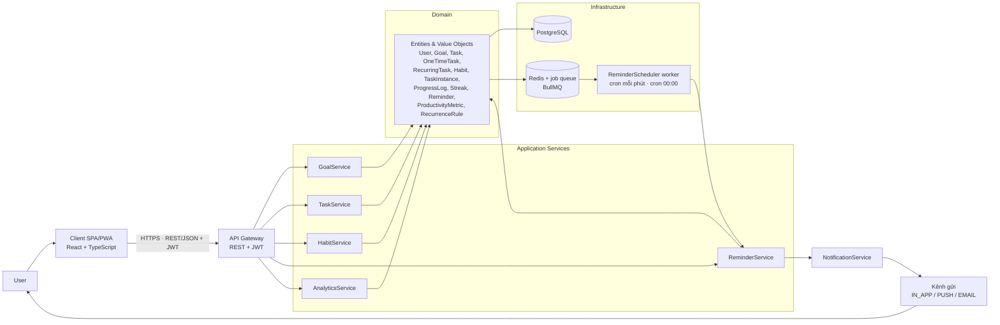
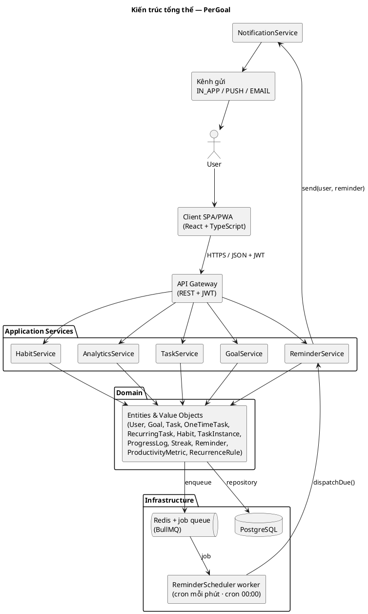
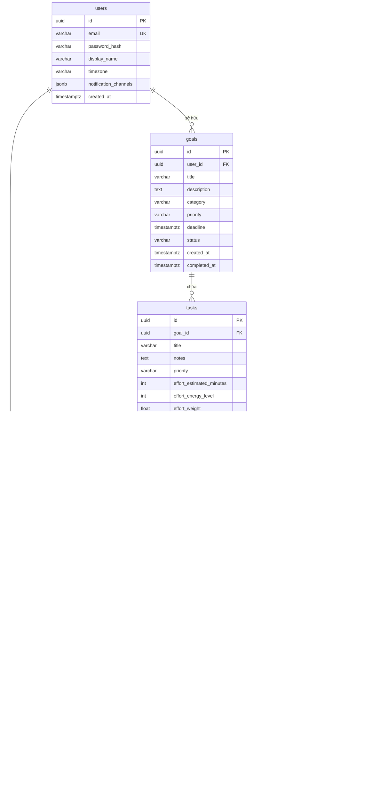
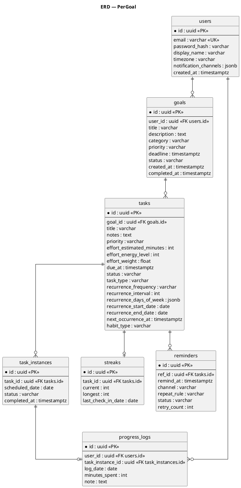
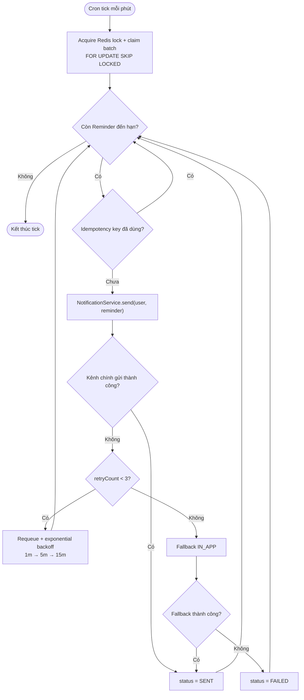
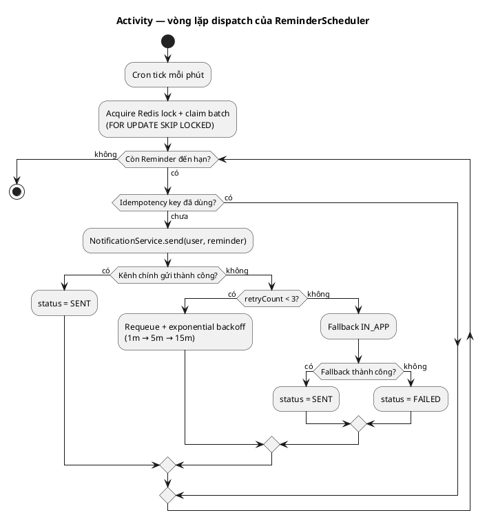
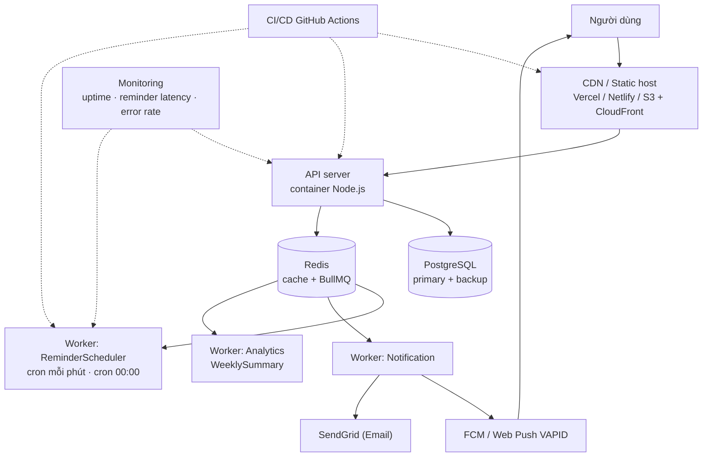
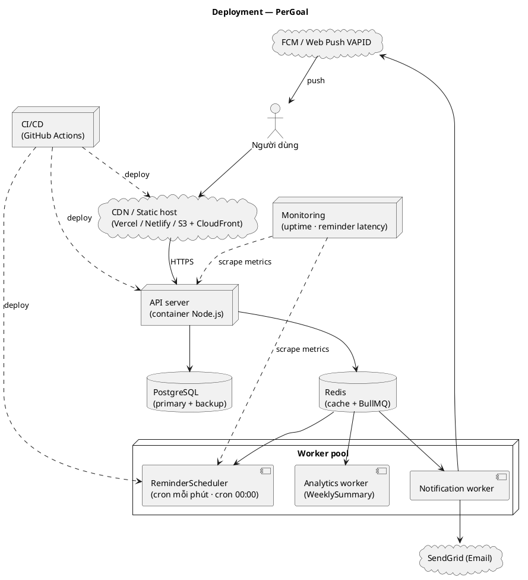
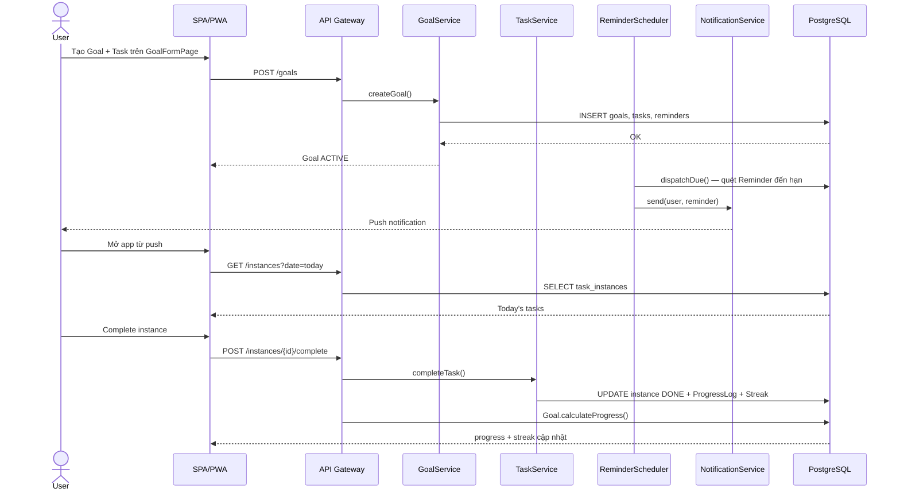
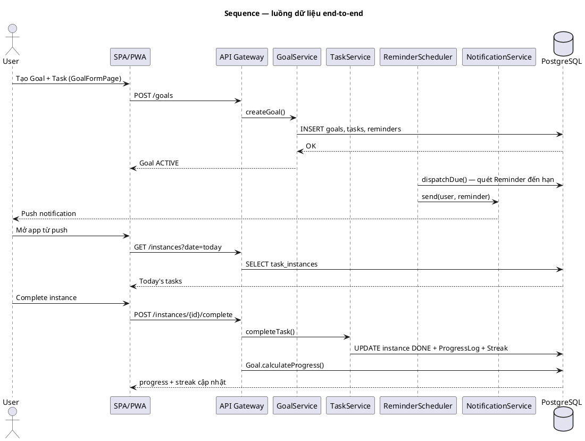

# 05 — Kiến trúc & Vận hành

Tài liệu này mô tả kiến trúc triển khai của **PerGoal**: từ Client SPA/PWA qua API Gateway, các Application Service (`GoalService`, `TaskService`, `HabitService`, `ReminderService`, `AnalyticsService`), Domain entities, Infrastructure (PostgreSQL, Redis + job queue, `ReminderScheduler` worker) tới `NotificationService` và các kênh `IN_APP` / `PUSH` / `EMAIL`. Nội dung bám sát mục 6 (Kiến trúc) và mục 8 (Quy ước trình bày) của spec chuẩn.

---

## 1. Kiến trúc tổng thể

Sơ đồ component dưới đây thể hiện luồng chính: **Client SPA/PWA → API Gateway (REST + JWT) → Application Services → Domain (entities) → Infrastructure (PostgreSQL, Redis + job queue, ReminderScheduler worker) → NotificationService → kênh IN_APP/PUSH/EMAIL**.





*Chú thích: Client chỉ nói chuyện với API Gateway qua HTTPS/JSON + JWT; mọi nghiệp vụ đi qua Application Services rồi tới Domain thuần. Infrastructure đảm nhiệm lưu trữ và hàng đợi; `ReminderScheduler` là worker nền gọi `ReminderService.dispatchDue()`, còn `NotificationService` là đầu mối duy nhất phát thông báo ra `IN_APP`/`PUSH`/`EMAIL`.*

---

## 2. Phân lớp & trách nhiệm

| Layer | Thành phần | Trách nhiệm | Công nghệ đề xuất |
|---|---|---|---|
| **Client** | SPA/PWA, service worker, **ReminderPopup**, **NotificationCenter**, **TaskFormModal**, các page (DashboardPage, GoalsPage, …) | Render UI responsive, quản lý state, nhận Web Push, gọi REST API, optimistic UI khi check-in/complete, cache app shell khi offline | React + TypeScript, Vite, React Query, Tailwind CSS, Workbox (service worker) |
| **API** | API Gateway, JWT middleware, validation, rate limit, versioning | Xác thực/ủy quyền, kiểm tra schema request, định tuyến tới Application Service, chuẩn hóa response/error | Node.js (NestJS/Express), OpenAPI, Zod/class-validator, helmet, rate-limit |
| **Application** | `GoalService`, `TaskService`, `HabitService`, `ReminderService`, `AnalyticsService`, `NotificationService`; điều phối bởi `ReminderScheduler` | Hiện thực use case (mục 5 spec), transaction boundary, gọi repository, enqueue job, tổng hợp dữ liệu cho `/stats` | TypeScript services, BullMQ producer/consumer |
| **Domain** | `User`, `Goal`, `Task` (`OneTimeTask`, `RecurringTask`, `Habit`), `TaskInstance`, `ProgressLog`, `Streak`, `Reminder`; VO `ProductivityMetric`, `RecurrenceRule`; enums `Priority`, `GoalStatus`, `TaskStatus`, `ReminderStatus`, `ReminderChannel`, `Frequency`, `HabitType` | Quy tắc nghiệp vụ thuần: `calculateProgress()`, `nextOccurrence()`, `checkIn()`, `calculateStreak()`, `snooze()` — không phụ thuộc framework/hạ tầng | TypeScript thuần (không import framework), unit test độc lập |
| **Infrastructure** | Repository, PostgreSQL, Redis + job queue, worker `ReminderScheduler`, Web Push (VAPID/FCM), Email (SendGrid), logging/monitoring | Persistence, cache, hàng đợi job, gửi push/email, cron nền, backup, thu thập metrics | PostgreSQL, Redis + BullMQ, FCM/VAPID, SendGrid, Sentry, Prometheus/Grafana |

*Chú thích: phụ thuộc một chiều từ ngoài vào trong — Client → API → Application → Domain; Infrastructure là adapter được Domain/Application gọi qua interface, không chứa nghiệp vụ.*

---

## 3. Thiết kế API

REST/JSON, xác thực bằng **JWT Bearer**. Các endpoint public thuộc nhóm `/auth` (register, login, refresh, forgot-password); toàn bộ endpoint còn lại yêu cầu `Authorization: Bearer <accessToken>`.

### 3.1 Nhóm `/auth`

| Method | Path | Mô tả | Request chính | Response chính | Auth |
|---|---|---|---|---|---|
| POST | `/auth/register` | Đăng ký tài khoản mới | `email`, `password`, `displayName` | `user`, `accessToken`, `refreshToken` | Public |
| POST | `/auth/login` | Đăng nhập | `email`, `password` | `user`, `accessToken`, `refreshToken` | Public |
| POST | `/auth/refresh` | Cấp lại access token | `refreshToken` | `accessToken` mới | Public |
| POST | `/auth/logout` | Thu hồi refresh token | `refreshToken` | `204 No Content` | JWT |
| POST | `/auth/forgot-password` | Yêu cầu đặt lại mật khẩu | `email` | `202 Accepted` (luôn trả về như nhau để chống dò email) | Public |
| GET | `/auth/me` | Lấy hồ sơ + cài đặt | — | `user` (gồm `timezone`, `notificationChannels`) | JWT |

### 3.2 Nhóm `/goals`

| Method | Path | Mô tả | Request chính | Response chính | Auth |
|---|---|---|---|---|---|
| GET | `/goals` | Danh sách Goal, lọc theo `status`, `priority`, `category` | query `status`, `priority`, `page` | mảng `Goal` + `progress` | JWT |
| POST | `/goals` | Tạo Goal (kèm Task ban đầu nếu có) | `title`, `description`, `category`, `priority`, `deadline`, `tasks[]` | `Goal` với `status=ACTIVE` | JWT |
| GET | `/goals/{id}` | Chi tiết Goal + danh sách Task | — | `Goal`, `tasks[]`, `progress` | JWT |
| PATCH | `/goals/{id}` | Cập nhật Goal | `title`, `priority`, `deadline`, … | `Goal` đã cập nhật | JWT |
| POST | `/goals/{id}/complete` | Đánh dấu hoàn thành thủ công | — | `Goal` với `status=COMPLETED`, `completedAt` | JWT |
| DELETE | `/goals/{id}` | Lưu trữ Goal | — | `Goal` với `status=ARCHIVED` | JWT |

### 3.3 Nhóm `/tasks`

| Method | Path | Mô tả | Request chính | Response chính | Auth |
|---|---|---|---|---|---|
| GET | `/tasks` | Danh sách Task theo Goal | query `goalId`, `status` | mảng `Task` | JWT |
| POST | `/tasks` | Tạo Task (one-time hoặc recurring) | `goalId`, `title`, `priority`, `effort`, `dueAt`, `recurrenceRule?` | `Task` (`OneTimeTask`/`RecurringTask`) | JWT |
| PATCH | `/tasks/{id}` | Cập nhật / đổi lịch Task | `title`, `priority`, `effort`, `recurrenceRule` | `Task` đã cập nhật | JWT |
| POST | `/tasks/{id}/skip` | Bỏ qua một Task | `reason?` | `Task` với `status=SKIPPED` | JWT |

### 3.4 Nhóm `/habits`

| Method | Path | Mô tả | Request chính | Response chính | Auth |
|---|---|---|---|---|---|
| GET | `/habits` | Danh sách Habit | query `goalType` (`BUILD`/`QUIT`) | mảng `Habit` + `streak` | JWT |
| POST | `/habits` | Tạo Habit | `goalId`, `title`, `goalType`, `recurrenceRule`, `remindAt` | `Habit` + `Streak` khởi tạo | JWT |
| POST | `/habits/{id}/check-in` | Check-in theo ngày | `date` (mặc định hôm nay) | `Streak`, `TaskInstance` tương ứng | JWT |
| GET | `/habits/{id}/streak` | Xem chuỗi streak | — | `current`, `longest`, `lastCheckInDate`, `isActive` | JWT |

### 3.5 Nhóm `/instances`

| Method | Path | Mô tả | Request chính | Response chính | Auth |
|---|---|---|---|---|---|
| GET | `/instances` | Instance theo ngày (Today's tasks) | query `date`, `status` | mảng `TaskInstance` + Task cha | JWT |
| POST | `/instances/{id}/complete` | Hoàn thành instance | `completedAt?`, `progressLog?` | `TaskInstance` `DONE`, `goalProgress`, `streak?` | JWT |
| POST | `/instances/{id}/skip` | Bỏ qua instance | `reason?` | `TaskInstance` `SKIPPED` | JWT |
| PATCH | `/instances/{id}/reschedule` | Dời lịch instance | `scheduledDate` mới | `TaskInstance` đã dời | JWT |

### 3.6 Nhóm `/reminders`

| Method | Path | Mô tả | Request chính | Response chính | Auth |
|---|---|---|---|---|---|
| GET | `/reminders` | Reminder đang chờ / theo đối tượng | query `refId`, `status` | mảng `Reminder` | JWT |
| POST | `/reminders` | Tạo Reminder thủ công | `refId`, `remindAt`, `channel`, `repeatRule?` | `Reminder` `SCHEDULED` | JWT |
| POST | `/reminders/{id}/snooze` | Hoãn nhắc | `minutes` | `Reminder` `SNOOZED`, `remindAt` mới | JWT |
| POST | `/reminders/{id}/dismiss` | Tắt nhắc | — | `Reminder` `DISMISSED` | JWT |

### 3.7 Nhóm `/stats`

| Method | Path | Mô tả | Request chính | Response chính | Auth |
|---|---|---|---|---|---|
| GET | `/stats/summary` | Tổng quan Dashboard | query `from`, `to` | `completionRate`, `focusMinutes`, `activeStreaks` | JWT |
| GET | `/stats/completion-rate` | Tỷ lệ hoàn thành theo kỳ | query `period` (`day`/`week`/`month`) | chuỗi thời gian tỷ lệ | JWT |
| GET | `/stats/focus-minutes` | Tổng phút tập trung | query `period` | chuỗi thời gian `minutesSpent` | JWT |

### 3.8 Ví dụ JSON

**(a) Tạo Goal kèm Task lặp lại**

```json
// POST /goals
{
  "title": "Chạy 5K mỗi tuần",
  "description": "Duy trì 3 buổi/tuần",
  "category": "health",
  "priority": "HIGH",
  "deadline": "2026-12-31",
  "tasks": [
    {
      "title": "Chạy 5K",
      "effort": { "estimatedMinutes": 30, "energyLevel": 3, "weight": 1.0 },
      "recurrenceRule": {
        "frequency": "WEEKLY",
        "interval": 1,
        "daysOfWeek": ["MON", "WED", "SAT"],
        "startDate": "2026-09-21"
      }
    }
  ]
}
```

```json
// 201 Created
{
  "id": "g_01HZX...",
  "status": "ACTIVE",
  "createdAt": "2026-09-18T03:00:00Z",
  "tasks": [{ "id": "t_01HZY...", "type": "RecurringTask", "nextOccurrenceAt": "2026-09-21T00:00:00Z" }]
}
```

**(b) Hoàn thành một TaskInstance**

```json
// POST /instances/{id}/complete
{
  "completedAt": "2026-09-18T07:42:00Z",
  "progressLog": { "minutesSpent": 32, "note": "Buổi chạy tốt" }
}
```

```json
// 200 OK
{
  "id": "i_01HZZ...",
  "status": "DONE",
  "completedAt": "2026-09-18T07:42:00Z",
  "goalId": "g_01HZX...",
  "goalProgress": 0.66
}
```

**(c) Check-in Habit**

```json
// POST /habits/{id}/check-in
{ "date": "2026-09-18" }
```

```json
// 200 OK
{
  "habitId": "h_01HZW...",
  "taskInstance": { "id": "i_01I00...", "scheduledDate": "2026-09-18", "status": "DONE" },
  "streak": { "current": 4, "longest": 9, "lastCheckInDate": "2026-09-18", "isActive": true }
}
```

*Chú thích: mọi response lỗi dùng dạng `{ "code", "message", "details?" }`; các thao tác complete/check-in là idempotent theo `(instanceId|habitId, ngày)` để an toàn khi client retry.*

---

## 4. Mô hình dữ liệu (ERD)

Các bảng lưu trữ tương ứng 1-1 với entities ở mục 3 spec: `users`, `goals`, `tasks` (single-table cho `OneTimeTask`/`RecurringTask`/`Habit` qua discriminator), `task_instances`, `progress_logs`, `streaks`, `reminders`.





*Chú thích: `tasks` dùng một bảng chung với `task_type` là discriminator persistence (`one_time` | `recurring` | `habit`), ánh xạ các lớp `OneTimeTask`/`RecurringTask`/`Habit`; `streaks.task_id` chỉ trỏ tới bản ghi `Habit`. Trường `status` lưu các giá trị enum `GoalStatus`, `TaskStatus`, `ReminderStatus`; `channel` lưu `ReminderChannel`. `effort_*` là ánh xạ của VO `ProductivityMetric`, `recurrence_*` là ánh xạ của VO `RecurrenceRule`. `reminders.retry_count` phục vụ cơ chế retry ở mục 5.*

---

## 5. Cơ chế nhắc nhở (Reminder Engine)

### 5.1 Cron mỗi phút — `dispatchDue()`

- `ReminderScheduler` chạy cron mỗi phút (vd `* * * * *`) và gọi `ReminderService.dispatchDue()`.
- Tập đến hạn gồm các `Reminder` có `status = SCHEDULED` (hoặc `SNOOZED` đã tới `remindAt`) và `remindAt <= now`.
- Worker lấy việc theo lô bằng `SELECT ... WHERE status = 'SCHEDULED' AND remind_at <= now() ORDER BY remind_at LIMIT :batch FOR UPDATE SKIP LOCKED` để nhiều worker chạy song song không xử lý trùng.
- Một khóa Redis (`SET NX EX`) đảm bảo chỉ một tiến trình giữ nhịp cron; các worker khác chỉ tiêu thụ job từ queue.
- Mỗi reminder gửi xong được cập nhật `status = SENT`; lỗi sau cùng chuyển `FAILED`.

### 5.2 Cron 00:00 — sinh `TaskInstance` & đánh dấu `OVERDUE`

- Cron `0 0 * * *` (chạy theo múi giờ `User.timezone`, luân phiên theo nhóm timezone) kích hoạt `TaskService.generateInstances()`:
  - Quét `RecurringTask`/`Habit` đến kỳ, gọi `RecurrenceRule.nextOccurrence(after)` để sinh `TaskInstance` cho ngày/tuần tương ứng (đúng luồng 3 ở mục 5 spec).
  - Tạo kèm `Reminder` tương ứng theo `remindAt` mặc định của User (kênh lấy từ `notificationChannels`).
- Cùng cron, quét các `TaskInstance` quá hạn chưa `DONE`/`SKIPPED` của ngày trước và cập nhật `status = OVERDUE`; Goal liên quan có thể chuyển `GoalStatus.OVERDUE`.
- Job sinh instance là idempotent: mỗi `(taskId, scheduledDate)` chỉ tồn tại tối đa một bản ghi (unique index), chạy lại không tạo trùng.

### 5.3 Timezone của User

- `remindAt` lưu UTC (`timestamptz`); giờ nhắc do User cấu hình theo `User.timezone` và được quy đổi sang UTC khi tạo `Reminder`.
- Cron 00:00 không chạy một lần toàn cầu mà chia nhóm theo offset timezone (vd chạy mỗi giờ cho các nhóm UTC+7, UTC+0, UTC-5…) để "ngày" của mỗi User đúng theo giờ địa phương.
- Khi User đổi timezone trong SettingsPage, các `Reminder` chưa gửi được tính lại `remindAt` theo múi giờ mới.

### 5.4 Chống trùng (idempotency)

- Trước khi gửi, worker kiểm tra khóa `idem:reminder:{reminderId}:{epochMinute}` bằng `SET NX` trên Redis; nếu khóa đã tồn tại thì bỏ qua (at-most-once cho mỗi phút đến hạn).
- Khóa có TTL (vd 24 giờ). Ở tầng DB, `FOR UPDATE SKIP LOCKED` + chuyển `status` ngay sau khi gửi đảm bảo không double-send khi worker restart.
- API complete/check-in cũng idempotent theo ngày, nên retry từ client không tạo `ProgressLog`/`Streak` trùng.

### 5.5 Retry & fallback

- Khi kênh chính (thường là `PUSH`) gửi thất bại, job được đưa lại queue với **tối đa 3 lần thử** và **exponential backoff** `1 phút → 5 phút → 15 phút`.
- Nếu sau 3 lần vẫn thất bại: **fallback sang `IN_APP`** (ghi nhận thông báo để NotificationCenter hiển thị khi User mở app). Nếu fallback thành công → `status = SENT`; nếu tất cả kênh đều thất bại → `status = FAILED` để đội vận hành theo dõi.
- Lỗi được ghi kèm `retry_count`; job vượt ngưỡng chuyển vào dead-letter queue để không chặn hàng đợi chính.

### 5.6 Snooze & dismiss

- `POST /reminders/{id}/snooze` gọi `ReminderService.snooze(minutes)`: `status = SNOOZED`, `remindAt = now + minutes`; hết thời gian snooze, reminder quay lại tập đến hạn của `dispatchDue()`.
- `POST /reminders/{id}/dismiss` gọi `dismiss()`: `status = DISMISSED`, không nhắc lại.
- Khi `TaskInstance` được `complete()`/`markDone()` hoặc Habit được check-in, mọi `Reminder` `SCHEDULED`/`SNOOZED` gắn với instance đó được tự động `dismiss()` để tránh nhắc lại việc đã xong.

### 5.7 Giới hạn tải

- Mỗi tick chỉ xử lý tối đa `batch` reminder (vd 500) rồi nhường lượt tick sau; queue đảm bảo phần còn lại không mất.
- Concurrency worker cấu hình theo hạn mức nhà cung cấp push (FCM/VAPID); áp rate limit theo User (vd tối đa 1 thông báo/giây/user) để tránh spam.
- Worker scale ngang; cron chỉ chạy trên leader nhờ Redis lock.

### 5.8 Activity diagram — vòng lặp dispatch





*Chú thích: mỗi tick là một vòng lặp độc lập, an toàn khi chạy nhiều worker nhờ khóa Redis + `SKIP LOCKED`; nhánh retry/fallback đảm bảo thông báo vẫn tới User qua `IN_APP` khi `PUSH` thất bại.*

---

## 6. Đồng bộ & trải nghiệm realtime

- **PWA service worker (Workbox):** cache app shell và assets tĩnh (stale-while-revalidate); các request `GET /instances`, `/goals` dùng network-first có cache dự phòng để DashboardPage vẫn mở được khi mạng yếu. Hàng đợi Background Sync giữ các mutation thất bại (complete/skip/check-in) và tự gửi lại khi có mạng.
- **Web Push VAPID/FCM:** `NotificationService` gửi push qua FCM (Chrome/Android) và Web Push VAPID (trình duyệt hỗ trợ); service worker nhận sự kiện `push`, hiển thị notification và mở đúng màn hình khi User bấm (vd `/instances?date=today`). Đăng ký push subscription lưu cùng User và chỉ gửi khi `notificationChannels` có `PUSH`.
- **Optimistic UI khi check-in/complete:** UI cập nhật ngay trạng thái `TaskInstance`/`Streak` (progress ring, streak widget) trước khi server phản hồi; React Query thực hiện mutation rồi rollback nếu API lỗi. Vì API idempotent theo ngày, retry/Background Sync không gây nhân đôi dữ liệu.
- **Đồng bộ nhiều thiết bị:** mọi thay đổi đi qua API là nguồn sự thật duy nhất; client refetch khi app được focus và khi nhận push, tránh trạng thái cũ trên thiết bị thứ hai.

---

## 7. Bảo mật & quyền riêng tư

- **JWT + refresh token:** access token ngắn hạn (vd 15 phút) ký HS256/RS256; refresh token dài hạn lưu dạng hash trong DB, xoay vòng khi dùng (`/auth/refresh`) và thu hồi khi logout. Mọi endpoint (trừ nhóm public của `/auth`) kiểm tra JWT và quyền sở hữu tài nguyên theo `userId`.
- **Mật khẩu:** hash bằng bcrypt (cost ≥ 12) hoặc argon2id, kèm salt riêng; không bao giờ log hay trả về `passwordHash`. Quên mật khẩu dùng token dùng một lần, hết hạn ngắn.
- **HTTPS bắt buộc:** HSTS, TLS 1.2+; cookie/refresh token dùng `HttpOnly`, `Secure`, `SameSite=Strict` nếu lưu cookie.
- **Rate limit:** giới hạn theo IP và theo User cho `/auth/login`, `/auth/register`, `/auth/forgot-password` (chống brute-force) và cho các endpoint ghi; kiểm tra schema request để chặn dữ liệu bất thường.
- **Quyền riêng tư:** dữ liệu thói quen, Goal, `ProgressLog` và `Streak` là **thông tin nhạy cảm về hành vi cá nhân**. Nguyên tắc: chỉ chủ sở hữu truy cập (row-level theo `userId`); mã hóa khi truyền (TLS) và khi lưu (at-rest); không chia sẻ cho bên thứ ba; log không chứa nội dung Goal/ghi chú; cho phép User xóa tài khoản kèm toàn bộ dữ liệu liên quan.

---

## 8. Triển khai & vận hành





*Chú thích: ứng dụng tách API server và worker pool dùng chung PostgreSQL/Redis; CI/CD triển khai cả ba thành phần; monitoring theo dõi uptime và độ trễ nhắc nhở.*

- **CI/CD:** GitHub Actions — lint + unit test (Domain), integration test (API + PostgreSQL/Redis tạm), build image, chạy migration (expand/contract), deploy API rồi worker; rollback theo image tag.
- **Monitoring:** healthcheck `/health` (uptime), **reminder latency** (thời gian từ `remindAt` đến lúc gửi thành công, đo qua queue timestamp), tỷ lệ `FAILED`, độ dài queue, p95 API latency; cảnh báo khi queue backlog hoặc cron không chạy trong N phút.
- **Backup:** PostgreSQL backup toàn phần hằng ngày + WAL archiving/PITR; Redis bật AOF cho queue; kiểm thử restore định kỳ. Dữ liệu người dùng xóa theo yêu cầu được loại khỏi bản backup kế tiếp.
- **Scaling worker:** scale ngang theo độ sâu queue (HPA/autoscaling); cron chỉ chạy trên leader qua Redis lock; tăng batch size và concurrency khi cao điểm buổi sáng/tối; dead-letter queue xử lý thủ công.

---

## 9. Luồng dữ liệu end-to-end





*Chú thích: sequence tóm tắt vòng lặp cốt lõi — tạo Goal/Task → scheduler đến hạn gửi push → User mở app → complete instance → cập nhật tiến độ Goal và Streak (nếu là Habit).*

---

## Liên kết

- [01 — Tổng quan hệ thống](./01-tong-quan-he-thong.md)
- [02 — Mô hình hướng đối tượng](./02-mo-hinh-huong-doi-tuong.md)
- [03 — Workflow hệ thống](./03-workflow-he-thong.md)
- [06 — Lộ trình triển khai](./06-lo-trinh-trien-khai.md)
