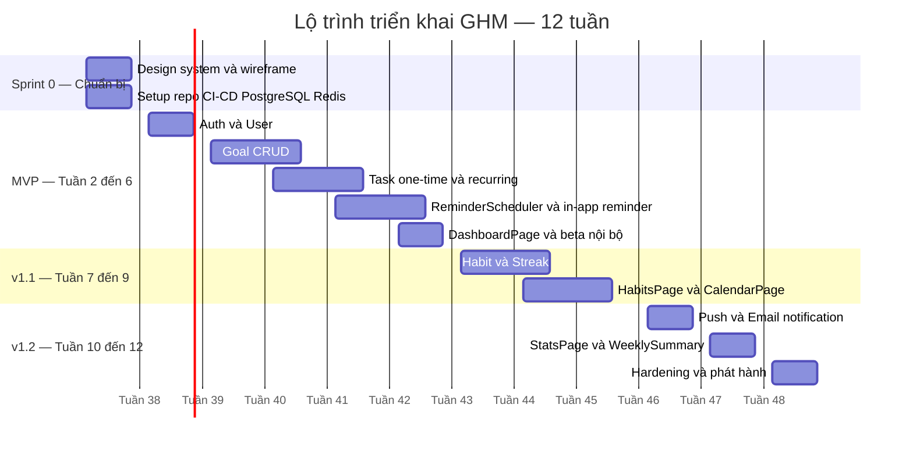
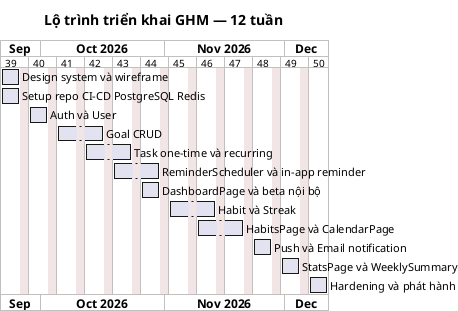

# 06 — Lộ trình triển khai

Tài liệu này chuyển thiết kế của **Goal Habit Manager (GHM)** thành lộ trình triển khai 12 tuần: thứ tự ưu tiên, phạm vi từng giai đoạn (MVP → v1.1 → v1.2 → v2), ước lượng theo story point, phân công theo role, rủi ro và KPI. Roadmap bám sát mục 7 của spec chuẩn; các hạng mục ngoài spec được ghi rõ là "(mở rộng v2)".

## 1. Nguyên tắc ưu tiên

- **Giá trị người dùng trước, kỹ thuật sau**: mỗi sprint phải kết thúc bằng một luồng người dùng chạy được (vertical slice), không làm hạ tầng "chay" tách rời khỏi feature.
- **MoSCoW** làm khung phân loại: Must cho MVP, Should cho v1.1/v1.2, Could cho v2, Won't trong 12 tuần để chống scope creep.
- **Ưu tiên theo rủi ro**: phần khó và dễ sai nhất (`ReminderScheduler`, timezone, `RecurringTask`) làm sớm để fail fast.
- **Walking skeleton**: dựng luồng mỏng xuyên suốt LandingPage → AuthPage → OnboardingPage → MainPage → DashboardPage trước, rồi dày dần tính năng.
- **Không đánh đổi chất lượng lõi**: auth, tính đúng đắn của lịch lặp và nhắc nhở là bất khả xâm phạm; các phần trang trí (theme, gamification) hoãn về v2.

| Mức MoSCoW | Hạng mục | Giai đoạn |
|---|---|---|
| Must | Auth (User), Goal CRUD, Task one-time + recurring, in-app reminder, DashboardPage | MVP |
| Should | Habit + Streak, CalendarPage | v1.1 |
| Should | Push/Email notification, StatsPage, WeeklySummary | v1.2 |
| Could | AI gợi ý mục tiêu, accountability partner, gamification (mở rộng v2) | v2 |
| Won't (12 tuần) | Native app, multi-tenant/team, multi-device sync nâng cao | Sau v2 |

## 2. Roadmap tổng quan

| Giai đoạn | Phạm vi (feature) | Giá trị mang lại | Thời lượng ước tính |
|---|---|---|---|
| **MVP** | Auth, Goal CRUD, Task one-time + recurring, in-app reminder, Dashboard | Người dùng tạo được mục tiêu, nhiệm vụ và nhận nhắc trong app — vòng lặp giá trị cốt lõi chạy end-to-end | 5 tuần (Tuần 2–6) |
| **v1.1** | Habit + Streak, CalendarPage | Duy trì thói quen bằng streak và linh hoạt đổi lịch — tăng retention | 3 tuần (Tuần 7–9) |
| **v1.2** | Push/Email notification, StatsPage, WeeklySummary | Nhắc nhở chủ động ngoài app + nhìn lại tiến độ — tăng quay lại và hoàn thành | 3 tuần (Tuần 10–12) |
| **v2** | AI gợi ý mục tiêu, accountability partner, gamification (mở rộng v2) | Cá nhân hóa và động lực xã hội — mở rộng tệp người dùng | 8–12 tuần (sau Tuần 12) |

Ghi chú: trước MVP có **Sprint 0 (Tuần 1)** là giai đoạn chuẩn bị kỹ thuật/thiết kế (wireframe, repo, CI/CD, PostgreSQL, Redis) — không phát hành feature nhưng là tiền đề cho toàn bộ roadmap.

## 3. Chi tiết từng giai đoạn

### 3.1 Sprint 0 — Chuẩn bị (Tuần 1)

- [ ] Wireframe + design system cho LandingPage, AuthPage, OnboardingPage, MainPage và 6 tab
- [ ] Khởi tạo repo, CI/CD, môi trường dev/staging
- [ ] Dựng PostgreSQL + Redis + job queue (BullMQ/Celery), cấu hình worker
- [ ] Chốt hợp đồng API (OpenAPI) cho `/auth`, `/goals`, `/tasks`, `/habits`, `/instances`, `/reminders`, `/stats`
- [ ] Định nghĩa test strategy (unit cho service, integration cho API, E2E cho luồng chính)

**Entity / Service liên quan**: chưa có entity nghiệp vụ; các service `GoalService`, `TaskService`, `HabitService`, `ReminderService`, `AnalyticsService`, `NotificationService`, `ReminderScheduler` được scaffold rỗng theo kiến trúc.

**Definition of Done**: CI xanh với lint + test khung; staging deploy tự động; OpenAPI publish; wireframe được duyệt.

**Rủi ro chính**: chậm chốt design/API contract làm lệch sprint sau; môi trường worker/queue chưa ổn định.

### 3.2 MVP (Tuần 2–6)

- [ ] `User`: register/login/updateSettings, JWT auth, LandingPage, AuthPage (Login/Register/ForgotPassword), OnboardingPage (timezone, giờ nhắc mặc định, Goal đầu tiên)
- [ ] `Goal` CRUD: GoalsPage → GoalDetailPage → GoalFormPage; status `DRAFT/ACTIVE/COMPLETED/ARCHIVED/OVERDUE`; `Goal.calculateProgress()`
- [ ] `Task` (abstract) với `OneTimeTask` và `RecurringTask` + `RecurrenceRule`; `RecurrenceRule.nextOccurrence()`; TaskFormModal
- [ ] `ReminderScheduler`: cron mỗi phút quét `Reminder` đến hạn; cron 00:00 sinh `TaskInstance` từ `RecurrenceRule` và đánh dấu `OVERDUE`
- [ ] In-app reminder: `NotificationService.send()` kênh `IN_APP`; ReminderPopup, NotificationCenter; snooze/dismiss
- [ ] Vòng hoàn thành: complete/skip → `ProgressLog` → cập nhật `Goal.calculateProgress()`
- [ ] DashboardPage: Today's tasks, progress ring, quick-add FAB; MainPage (sidebar/bottom-nav)

**Entity / Service liên quan**: `User`, `Goal`, `Task`, `OneTimeTask`, `RecurringTask`, `TaskInstance`, `ProgressLog`, `Reminder`; value objects `ProductivityMetric`, `RecurrenceRule`; services `GoalService`, `TaskService`, `ReminderService`, `ReminderScheduler`, `NotificationService`; enums `Priority`, `GoalStatus`, `TaskStatus`, `ReminderStatus`, `ReminderChannel`, `Frequency`.

**Definition of Done**: luồng Workflow 1–4 chạy thật trên staging; scheduler sinh instance đúng ngày và không trùng; dữ liệu timezone lưu UTC kèm `User.timezone`; unit test cho `ProductivityMetric`, `RecurrenceRule`, `calculateProgress()`; beta nội bộ 5–10 người dùng với KPI đo được.

**Rủi ro chính**: scope creep từ các tab chưa thuộc MVP; logic `RecurrenceRule` sai với tháng/ngày đặc biệt; `ReminderScheduler` chạy trùng khi scale worker; JWT/passwordHash chưa đúng chuẩn bảo mật.

### 3.3 v1.1 (Tuần 7–9)

- [ ] `Habit` (BUILD/QUIT) extends `RecurringTask`; `Streak` với current/longest/lastCheckInDate
- [ ] `HabitService.checkIn()` và `calculateStreak()`; xử lý reset streak khi bỏ lỡ
- [ ] HabitsPage → HabitDetailPage: calendar heatmap, check-in button, streak info
- [ ] CalendarPage: xem tuần/tháng, kéo-thả đổi lịch (`Task.reschedule(newDate)`), sinh lại `TaskInstance`
- [ ] Dashboard: streak widget và progress ring cập nhật theo Habit

**Entity / Service liên quan**: `Habit`, `Streak`, `RecurringTask`, `TaskInstance`, `Reminder`; value object `RecurrenceRule`; service `HabitService`; enum `HabitType`, `TaskStatus`.

**Definition of Done**: streak đúng qua các mốc ngày/giờ và DST; check-in idempotent trong cùng ngày; heatmap tải dưới 1s với 1 năm dữ liệu; kéo-thả Calendar cập nhật đúng `TaskInstance` và UI Dashboard.

**Rủi ro chính**: edge case streak (qua nửa đêm, timezone, habit QUIT); hiệu năng Calendar/heatmap khi dữ liệu lớn; kéo-thả gây lệch dữ liệu giữa client và server.

### 3.4 v1.2 (Tuần 10–12)

- [ ] Push notification (Web Push VAPID/FCM) và Email (SendGrid) qua `ReminderChannel.PUSH`/`EMAIL`
- [ ] Cập nhật `ReminderStatus`: `SCHEDULED → SENT → SNOOZED/DISMISSED/FAILED` + retry/backoff cho `FAILED`
- [ ] StatsPage: completion rate, focus minutes, streak history, biểu đồ
- [ ] `AnalyticsService.completionRate()`, `focusMinutes()`, `weeklySummary()`
- [ ] Workflow 5: Chủ nhật 20:00 tổng kết tuần → `NotificationService.sendWeeklySummary()` + StatsPage
- [ ] Hardening: E2E, PWA install, hiệu năng, accessibility

**Entity / Service liên quan**: `Reminder`, `ProgressLog`, `TaskInstance`, `Streak`, `Habit`; services `AnalyticsService`, `NotificationService`, `ReminderService`; enum `ReminderChannel`, `ReminderStatus`.

**Definition of Done**: push hoạt động trên ít nhất Chrome/Edge/Firefox, có fallback in-app + email khi push bị chặn; WeeklySummary gửi đúng 20:00 theo `User.timezone`; tỷ lệ gửi lỗi có retry và log; StatsPage chỉ đọc từ API `/stats`.

**Rủi ro chính**: push không đáng tin (quyền bị từ chối, token hết hạn, iOS PWA); email vào spam; tổng kết tuần tính sai tuần khi đổi DST; tải analytics làm chậm DB.

### 3.5 v2 (Sau Tuần 12)

- [ ] AI gợi ý mục tiêu (mở rộng v2) dựa trên lịch sử `ProgressLog`, `AnalyticsService` và `Goal` cũ
- [ ] Accountability partner (mở rộng v2): ghép cặp người dùng, nhắc nhở chung — cần thêm entity ngoài spec hiện tại
- [ ] Gamification (mở rộng v2): huy hiệu/thành tích gắn với `Streak`, `GoalStatus.COMPLETED`
- [ ] Thử nghiệm A/B để đo tác động từng tính năng trước khi mở rộng

**Entity / Service liên quan**: tái sử dụng `Goal`, `Habit`, `Streak`, `ProgressLog`, `AnalyticsService`, `NotificationService`; các entity mới cho accountability partner được đánh dấu "(mở rộng v2)" và cần cập nhật spec trước khi code.

**Definition of Done**: feature flag cho từng hạng mục; có metric riêng chứng minh tác động lên activation/retention; không phá vỡ API hiện có.

**Rủi ro chính**: gợi ý AI kém chất lượng gây nhiễu; chi phí hạ tầng/LLM; quyền riêng tư dữ liệu thói quen; phạm vi mở rộng quá nhanh khi đội còn nhỏ.

## 4. Biểu đồ Gantt

Chú thích: hai sơ đồ mô tả cùng một timeline 12 tuần (bắt đầu 21/09/2026), cuối tuần nghỉ; Sprint 0 ở tuần 1, MVP chạy tuần 2–6, v1.1 tuần 7–9, v1.2 tuần 10–12; v2 nằm ngoài biểu đồ (8–12 tuần tiếp theo).

## 5. Ước lượng & phân công

Quy ước: 1 story point (SP) ≈ 1 người-ngày; velocity mục tiêu ~13 SP/tuần cho đội 2 dev + 1 designer + QA bán thời gian.

| Feature | Giai đoạn | Effort (SP) | Role chính | Gợi ý song song / subagent |
|---|---|---|---|---|
| Design system + wireframe 6 tab | Sprint 0 | 5 | Designer | Chạy song song với setup hạ tầng |
| Setup repo, CI/CD, PostgreSQL, Redis, queue | Sprint 0 | 5 | Backend | Subagent infra độc lập |
| Auth & User (JWT, AuthPage, OnboardingPage) | MVP | 8 | Fullstack | Backend API trước, FE dùng mock theo OpenAPI |
| Goal CRUD (GoalService, GoalsPage, GoalFormPage) | MVP | 13 | Fullstack | Tách subagent FE/BE, chốt contract trước |
| Task + OneTimeTask + RecurringTask + TaskInstance (`generateInstances`) | MVP | 21 | Backend | Đường găng — ưu tiên làm sớm, FE làm TaskFormModal song song |
| ReminderScheduler + in-app reminder (ReminderPopup, NotificationCenter) | MVP | 21 | Backend | Subagent riêng cho scheduler + test timezone |
| DashboardPage + MainPage shell + beta nội bộ | MVP | 13 | Frontend | Phụ thuộc API `/stats`, `/instances` |
| Habit + Streak (`HabitService.checkIn`) | v1.1 | 13 | Backend | Song song FE HabitsPage |
| HabitsPage + HabitDetailPage (heatmap) | v1.1 | 13 | Frontend | Dùng API `/habits` đã chốt |
| CalendarPage (kéo-thả, `reschedule`) | v1.1 | 8 | Frontend | Phụ thuộc API `/instances` |
| Push/Email notification (VAPID/FCM, SendGrid) | v1.2 | 13 | Backend | Subagent infra notification, song song StatsPage |
| StatsPage + AnalyticsService + WeeklySummary | v1.2 | 13 | Fullstack | Backend aggregate trước, FE chart song song |
| Hardening, E2E, PWA, release | v1.2 | 8 | Fullstack | QA + cả đội review chéo |
| **Tổng** | | **154** | | ~12,8 SP/tuần trong 12 tuần |

Gợi ý chia việc theo subagent/parallel:

- **Contract-first**: chốt OpenAPI cho `/auth`, `/goals`, `/tasks`, `/habits`, `/instances`, `/reminders`, `/stats` ở Sprint 0 để Frontend và Backend không chặn nhau; FE dùng mock server khi BE chưa xong.
- **Subagent A (Backend lõi)**: `GoalService`, `TaskService`, `RecurrenceRule`, `generateInstances` — đường găng của dự án.
- **Subagent B (Backend nhắc nhở)**: `ReminderService`, `ReminderScheduler`, `NotificationService`, timezone/idempotency.
- **Subagent C (Frontend)**: MainPage, DashboardPage, GoalsPage, TaskFormModal, ReminderPopup.
- **Subagent D (Infra/QA)**: CI/CD, queue, E2E, PWA, load test scheduler.
- Mỗi feature một branch + PR nhỏ, review chéo; demo cuối mỗi tuần trên staging.

## 6. Rủi ro & giảm thiểu

| Rủi ro | Loại | Xác suất | Tác động | Giảm thiểu |
|---|---|---|---|---|
| Push notification không đáng tin (người dùng từ chối quyền, token hết hạn, iOS PWA hạn chế) | Kỹ thuật | Cao | Cao | Luôn có fallback in-app và email; trạng thái `ReminderStatus.FAILED` + retry/backoff; hướng dẫn bật quyền; theo dõi tỷ lệ gửi thành công |
| Sai lệch timezone/DST khi sinh lịch và nhắc | Kỹ thuật | Cao | Cao | Lưu UTC + `User.timezone`; mọi tính toán ngày qua `RecurrenceRule.nextOccurrence(after: DateTime)`; test bộ ca DST và các múi giờ khác nhau; hiển thị theo timezone người dùng |
| Scheduler trùng lặp (nhiều worker, retry, cron chồng lấn) sinh `TaskInstance`/`Reminder` trùng | Kỹ thuật | Trung bình | Cao | Khóa phân tán Redis; idempotency key theo `(taskId, scheduledDate)`; ràng buộc unique ở DB; chuyển trạng thái `ReminderStatus` một chiều |
| Người dùng bỏ dùng sau 2 tuần (retention thấp) | Sản phẩm | Cao | Cao | Onboarding 3 bước gọn; streak + gamification (mở rộng v2) tạo động lực; WeeklySummary email/push kéo quay lại; đo D7/D30 và can thiệp sớm |
| Scope creep, nhồi tính năng ngoài roadmap | Sản phẩm | Trung bình | Trung bình | Khóa phạm vi theo MoSCoW; mọi yêu cầu mới phải vào backlog v2; demo theo sprint |
| Lỗ hổng auth (JWT, passwordHash) | Kỹ thuật | Thấp | Cao | Băm mật khẩu chuẩn, refresh token, rate limit, kiểm thử bảo mật trước release |

## 7. Chỉ số thành công (KPI)

| KPI | Định nghĩa | Mục tiêu sau 3 tháng |
|---|---|---|
| Activation rate | % người dùng hoàn tất OnboardingPage và tạo `Goal` đầu tiên trong 24 giờ sau đăng ký | ≥ 60% |
| Retention D7 | % người dùng còn mở app và hoàn thành ít nhất 1 task ở ngày thứ 7 | ≥ 35% |
| Retention D30 | % người dùng còn hoạt động ở ngày thứ 30 | ≥ 20% |
| Completion rate | Tỷ lệ `TaskInstance` có `TaskStatus.DONE` trên tổng instance đến hạn trong tuần (không tính SKIPPED) | ≥ 65% |
| Streak trung bình | Số ngày streak hiện tại trung bình của các `Habit` đang hoạt động | ≥ 7 ngày |
| WeeklySummary engagement | % người dùng mở email/push WeeklySummary và truy cập StatsPage | ≥ 40% |

## 8. Kiến trúc tiến hóa

- **Tách microservice** khi worker `ReminderScheduler`/`NotificationService` trở thành điểm nghẽn hoặc cần scale độc lập (ví dụ: số reminder mỗi phút tăng vượt khả năng một tiến trình, hoặc cần deploy riêng để không ảnh hưởng API). Trước đó giữ nguyên modular monolith: API stateless scale ngang, worker tách tiến trình qua Redis + job queue.
- **Thêm AI gợi ý** khi đã có đủ dữ liệu lịch sử (`ProgressLog`, `AnalyticsService.completionRate()`, `Goal` đã hoàn thành) và có tín hiệu người dùng cần gợi ý — thuộc v2 (mở rộng v2), gọi qua service riêng để có thể thay model mà không đụng domain.
- **Multi-device sync nâng cao** khi người dùng thật sự dùng nhiều thiết bị và phàn nàn về dữ liệu lệch: bước đầu giữ server là source of truth qua REST; sau đó bổ sung cache local/offline và delta sync, xử lý xung đột theo last-write-wins cho entity đơn giản; cân nhắc WebSocket/SSE cho ReminderPopup thời gian thực.
- **Nguyên tắc chung**: mỗi bước tiến hóa phải có metric chứng minh nhu cầu, feature flag để rollback, và không phá vỡ hợp đồng API `/auth`, `/goals`, `/tasks`, `/habits`, `/instances`, `/reminders`, `/stats`.

## Liên kết

- [01 — Tổng quan hệ thống](./01-tong-quan-he-thong.md)
- [03 — Workflow hệ thống](./03-workflow-he-thong.md)
- [05 — Kiến trúc và vận hành](./05-kien-truc-va-van-hanh.md)
